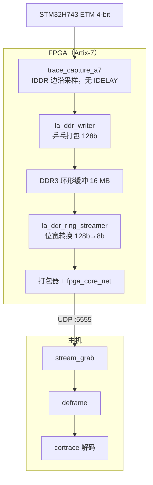

# cortrace-fpga

**简体中文** | [English](README_en.md)

一个基于 Artix-7 FPGA 的采集设备，用于抓取 Cortex-M 的**并口 ETM trace**，
并通过千兆 UDP 把原始字节流送给 [cortrace](https://github.com/FASTSHIFT/cortrace) 解码。



采集链路做到字节级无损：经过帧化 PRBS 压测（6.75 GB / 82.3 万块，0 字节错误）
以及真实 ETM trace 过 cortrace 的端到端压测（37.8 MB，0 fatal、0 丢弃调用、
调用栈配平、SysTick 异常正确渲染）验证，覆盖 BB=0/1 与 SysTick 开/关四种组合。

## 目录结构

| 路径 | 内容 |
|------|------|
| `rtl/` | 自研采集数据通路（trace_capture_a7、la_ddr_writer、la_ddr_ring_streamer、DDR3 控制器、fpga_core_net、CSR） |
| `rtl/ddr3/ip/` | Xilinx MIG DDR3 + 时钟向导 IP（`.xci`，Vivado 2021.1） |
| `rtl/external/verilog-ethernet` | Alex Forencich 的 MAC/UDP/IP/ARP + AXIS（子模块） |
| `fpga_flow/` | Vivado 构建 TCL（`build_trace_stream.tcl`） |
| `host/decode/` | deframe 辅助 + 主机侧相位搜索（etm35lib、tpiu_official、recover、make_timebase） |
| `host/scripts/` | 采集（`stream_grab`）、CSR 控制（`trace_ctrl`）、PRBS/端到端压测、golden 对拍 |
| `host/target/` | STM32H743 目标板的 OpenOCD 配置 |
| `sim/` | Icarus Verilog manifest 回归（`run_verilog_tests.py`） |
| `docs/history/` | bring-up 阶段的设计/评审/根因记录 |

## 构建

```sh
source $XILINX_VIVADO/settings64.sh    # Vivado 2021.1
mkdir -p build && cd build
vivado -mode batch -source ../fpga_flow/build_trace_stream.tcl
```

## 采集 + 解码

```sh
# 一次性：让 stream_grab 无需 sudo 即可绑定网卡 + 使用大接收缓冲
sudo setcap 'cap_net_raw,cap_net_admin+ep' host/scripts/stream_grab

host/scripts/stream_grab <网卡> <秒数> cap.bin 256 512
# cortrace-decode --raw 在进程内完成 deframe（nibble 重组 + TPIU stream 2），
# 无需单独的 deframe 步骤。
cortrace-decode cap.bin mem.bin 08000000 syms.nm --raw --perf out.perftrace
```

## 测试

```sh
python3 sim/run_verilog_tests.py          # RTL 测试平台
cd host/decode && python3 -m pytest        # deframe 单元测试
```

## 相关仓库

- [**cortrace**](https://github.com/FASTSHIFT/cortrace) — ETMv4 解码器（OpenCSD）+ 调用栈 + Perfetto 导出
- [**stm32h743-etm-trace-firmware**](https://github.com/FASTSHIFT/stm32h743-etm-trace-firmware) — 确定性 selftrace 目标板固件

## 许可证

MIT（见 [`LICENSE`](LICENSE)）。复用的组件保留各自的许可证：
verilog-ethernet（MIT，子模块）。
