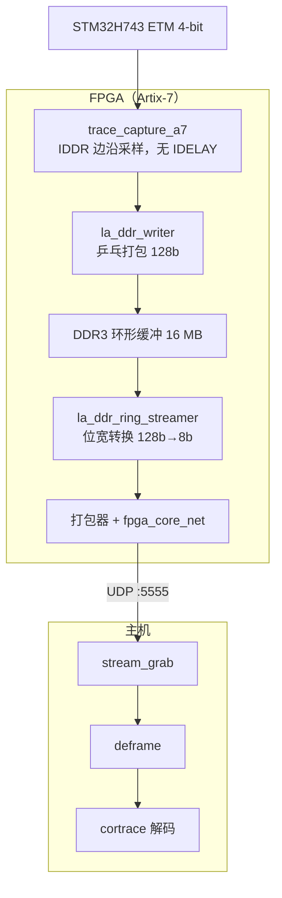

# cortrace-fpga

**简体中文** | [English](README_en.md)

一个基于 Artix-7 FPGA 的采集设备，用于抓取 Cortex-M 的**并口 ETM trace**，
并通过千兆 UDP 把原始字节流送给 [cortrace](https://github.com/FASTSHIFT/cortrace) 解码。


```mermaid
flowchart TD
    ETM["STM32H743 ETM 4-bit"] --> CAP["trace_capture_a7<br/>IDDR 边沿采样，无 IDELAY"]
    CAP --> WR["la_ddr_writer<br/>乒乓打包 128b"]
    WR --> RING["DDR3 环形缓冲 16 MB"]
    RING --> STR["la_ddr_ring_streamer<br/>位宽转换 128b→8b"]
    STR --> NET["打包器 + fpga_core_net"]
    NET -->|"UDP :5555"| GRAB["stream_grab"]
    GRAB --> DEFRAME["deframe"]
    DEFRAME --> CORTRACE["cortrace 解码"]

    subgraph FPGA["FPGA（Artix-7）"]
        CAP
        WR
        RING
        STR
        NET
    end
    subgraph HOST["主机"]
        GRAB
        DEFRAME
        CORTRACE
    end
```

采集链路做到字节级无损：经过帧化 PRBS 压测（6.75 GB / 82.3 万块，0 字节错误）
以及真实 ETM trace 过 cortrace 的端到端压测（37.8 MB，0 fatal、0 丢弃调用、
调用栈配平、SysTick 异常正确渲染）验证，覆盖 BB=0/1 与 SysTick 开/关四种组合。

## 目录结构

| 路径 | 内容 |
|------|------|
| `rtl/` | 自研采集数据通路（trace_capture_a7、la_ddr_writer、la_ddr_ring_streamer、DDR3 控制器、fpga_core_net、CSR） |
| `rtl/ddr3/ip/` | Xilinx MIG DDR3 + 时钟向导 IP（`.xci`，Vivado 2021.1） |
| `rtl/external/verilog-ethernet` | Alex Forencich 的 MAC/UDP/IP/ARP + AXIS（子模块） |
| `fpga_flow/` | Vivado 构建 TCL（`build_trace_stream.tcl`） |
| 采集 / CSR 控制 / 解码 / 对齐 / 融合 | 不在本仓库：由 [cortrace](https://github.com/FASTSHIFT/cortrace) 的 deb 包提供（`cortrace`、`cortrace-grab`、`cortrace-decode`） |
| `host/scripts/` | 板级调试小工具：PRBS/端到端压测、golden 对拍、探针采集（依赖已安装的 cortrace 包） |
| `host/target/` | STM32H743 目标板的 OpenOCD 配置 |
| `sim/` | Icarus Verilog manifest 回归（`run_verilog_tests.py`） |
| `docs/history/` | bring-up 阶段的设计/评审/根因记录 |

## 构建

```sh
source $XILINX_VIVADO/settings64.sh    # Vivado 2021.1
mkdir -p build && cd build
vivado -mode batch -source ../fpga_flow/build_trace_stream.tcl
```

## 采集 + 解码

主机侧工具全部在 cortrace 包里（从 GitHub Release 下载 `cortrace_*_amd64.deb`，`sudo apt install ./cortrace_*.deb`），无需特权：

```sh
export CORTRACE_OUT_DIR=~/traces               # 输出目录必须显式指定，cortrace 不会自己选
cortrace fpga ctrl set-width 4                 # FPGA 的 TPIU 位宽 / 重新武装
cortrace capture --iface <网卡> --elf fw.elf --secs 1   # 抓取 + 解码，生成 Perfetto
cortrace serve --iface <网卡> --elf fw.elf               # 在 ui.perfetto.dev 点 Start 即抓取
```

## 测试

```sh
python3 sim/run_verilog_tests.py          # RTL 测试平台
cd host/scripts && python3 -m pytest test_commit_msg_hook.py   # 提交信息 hook 测试
```

## 相关仓库

- [**cortrace**](https://github.com/FASTSHIFT/cortrace) — ETMv4 解码器（OpenCSD）+ 调用栈 + Perfetto 导出
- [**stm32h743-etm-trace-firmware**](https://github.com/FASTSHIFT/stm32h743-etm-trace-firmware) — 确定性 selftrace 目标板固件

## 许可证

MIT（见 [`LICENSE`](LICENSE)）。复用的组件保留各自的许可证：
verilog-ethernet（MIT，子模块）。
