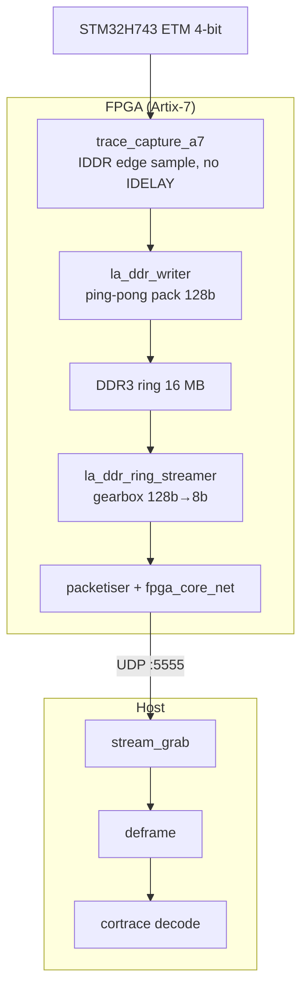

# cortrace-fpga

[简体中文](README.md) | **English**

An Artix-7 FPGA appliance that captures a Cortex-M **parallel ETM trace** port
and streams it over gigabit UDP for [cortrace](https://github.com/FASTSHIFT/cortrace) to decode.



The capture chain is byte-perfect: verified with a framed-PRBS soak
(6.75 GB / 823k blocks, 0 byte errors) and an end-to-end soak of real ETM
trace through cortrace (37.8 MB, 0 fatal, 0 dropped calls, balanced call
stack, SysTick exceptions rendered) across BB=0/1 and SysTick on/off.

## Layout

| Path | What |
|------|------|
| `rtl/` | Self-written capture datapath (trace_capture_a7, la_ddr_writer, la_ddr_ring_streamer, DDR3 ctrl, fpga_core_net, CSR) |
| `rtl/ddr3/ip/` | Xilinx MIG DDR3 + clocking wizard IP (`.xci`, Vivado 2021.1) |
| `rtl/external/verilog-ethernet` | Alex Forencich MAC/UDP/IP/ARP + AXIS (submodule) |
| `fpga_flow/` | Vivado build TCL (`build_trace_stream.tcl`) |
| `host/decode/` | Deframe front-end feeding cortrace (etm35lib, tpiu_official, deframe_to_etm, make_timebase) |
| `host/scripts/` | Capture (`stream_grab`), CSR control (`trace_ctrl`), PRBS/e2e soak, golden cross-check |
| `host/target/` | OpenOCD configs for the STM32H743 target |
| `sim/` | Icarus Verilog manifest regression (`run_verilog_tests.py`) |
| `docs/history/` | Design/review/root-cause record of the bring-up |

## Build

```sh
source $XILINX_VIVADO/settings64.sh    # Vivado 2021.1
mkdir -p build && cd build
vivado -mode batch -source ../fpga_flow/build_trace_stream.tcl
```

## Capture + decode

```sh
# one-time: let stream_grab bind-to-device + big rcvbuf without sudo
sudo setcap 'cap_net_raw,cap_net_admin+ep' host/scripts/stream_grab

host/scripts/stream_grab <iface> <secs> cap.bin 256 512
python3 host/decode/deframe_to_etm.py cap.bin etm.bin
cortrace-decode etm.bin mem.bin 08000000 syms.nm --perf out.perftrace
```

## Test

```sh
python3 sim/run_verilog_tests.py          # RTL testbenches
cd host/decode && python3 -m pytest        # deframe unit tests
```

## Related repos

- [**cortrace**](https://github.com/FASTSHIFT/cortrace) — ETMv4 decoder (OpenCSD) + call-stack + Perfetto exporter
- [**stm32h743-etm-trace-firmware**](https://github.com/FASTSHIFT/stm32h743-etm-trace-firmware) — deterministic selftrace target firmware

## License

MIT (see [`LICENSE`](LICENSE)). Reused components keep their own licenses:
verilog-ethernet (MIT, submodule).
