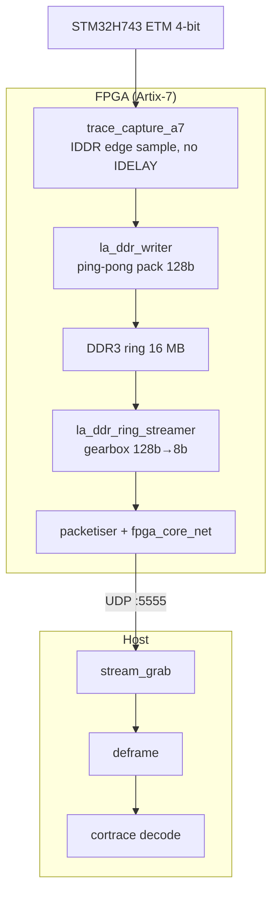

# cortrace-fpga

[简体中文](README.md) | **English**

An Artix-7 FPGA appliance that captures a Cortex-M **parallel ETM trace** port
and streams it over gigabit UDP for [cortrace](https://github.com/FASTSHIFT/cortrace) to decode.


```mermaid
flowchart TD
    ETM["STM32H743 ETM 4-bit"] --> CAP["trace_capture_a7<br/>IDDR edge sample, no IDELAY"]
    CAP --> WR["la_ddr_writer<br/>ping-pong pack 128b"]
    WR --> RING["DDR3 ring 16 MB"]
    RING --> STR["la_ddr_ring_streamer<br/>gearbox 128b→8b"]
    STR --> NET["packetiser + fpga_core_net"]
    NET -->|"UDP :5555"| GRAB["stream_grab"]
    GRAB --> DEFRAME["deframe"]
    DEFRAME --> CORTRACE["cortrace decode"]

    subgraph FPGA["FPGA (Artix-7)"]
        CAP
        WR
        RING
        STR
        NET
    end
    subgraph HOST["Host"]
        GRAB
        DEFRAME
        CORTRACE
    end
```

The capture chain is byte-perfect: verified with a framed-PRBS soak
(6.75 GB / 823k blocks, 0 byte errors) and an end-to-end soak of real ETM
trace through cortrace (37.8 MB, 0 fatal, 0 dropped calls, balanced call
stack, SysTick exceptions rendered) across BB=0/1 and SysTick on/off.

## Layout

| Path | What |
|------|------|
| `rtl/` | Self-written capture datapath (trace_capture_a7, la_ddr_writer, la_ddr_ring_streamer, DDR3 ctrl, fpga_core_net, CSR) |
| `rtl/ddr3/ip/` | Xilinx MIG DDR3 + clocking wizard IP (`.xci`, Vivado 2021.1) |
| `rtl/external/verilog-ethernet` | Alex Forencich MAC/UDP/IP/ARP + AXIS (submodule) |
| `fpga_flow/` | Vivado build TCL (`build_trace_stream.tcl`) |
| capture / CSR control / decode / align / fuse | Not in this repo: provided by the [cortrace](https://github.com/FASTSHIFT/cortrace) .deb (`cortrace`, `cortrace-grab`, `cortrace-decode`) |
| `host/scripts/` | Small board-debug tools: PRBS/e2e soak, golden cross-check, probe captures (need the cortrace package installed) |
| `host/target/` | OpenOCD configs for the STM32H743 target |
| `sim/` | Icarus Verilog manifest regression (`run_verilog_tests.py`) |
| `docs/history/` | Design/review/root-cause record of the bring-up |

## Build

```sh
source $XILINX_VIVADO/settings64.sh    # Vivado 2021.1
mkdir -p build && cd build
vivado -mode batch -source ../fpga_flow/build_trace_stream.tcl
```

## Capture + decode

The host tools live in the cortrace package (download `cortrace_*_amd64.deb` from its GitHub release and `sudo apt install ./cortrace_*.deb`). No privileges are needed:

```sh
export CORTRACE_OUT_DIR=~/traces               # always explicit; cortrace never picks a location
cortrace fpga ctrl set-width 4                 # FPGA TPIU width / re-arm
cortrace capture --iface <nic> --elf fw.elf --secs 1   # capture + decode to Perfetto
cortrace serve --iface <nic> --elf fw.elf               # press Start in ui.perfetto.dev to capture
```

## Test

```sh
python3 sim/run_verilog_tests.py          # RTL testbenches
cd host/scripts && python3 -m pytest test_commit_msg_hook.py   # commit-msg hook tests
```

## Related repos

- [**cortrace**](https://github.com/FASTSHIFT/cortrace) — ETMv4 decoder (OpenCSD) + call-stack + Perfetto exporter
- [**stm32h743-etm-trace-firmware**](https://github.com/FASTSHIFT/stm32h743-etm-trace-firmware) — deterministic selftrace target firmware

## License

MIT (see [`LICENSE`](LICENSE)). Reused components keep their own licenses:
verilog-ethernet (MIT, submodule).
