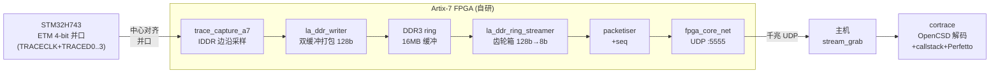
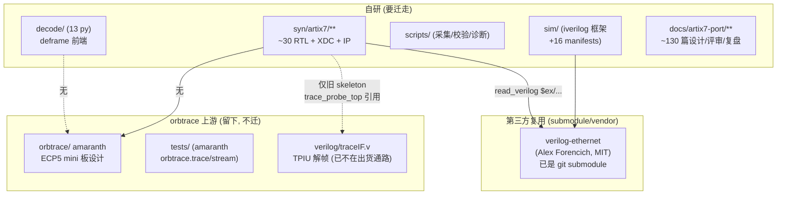
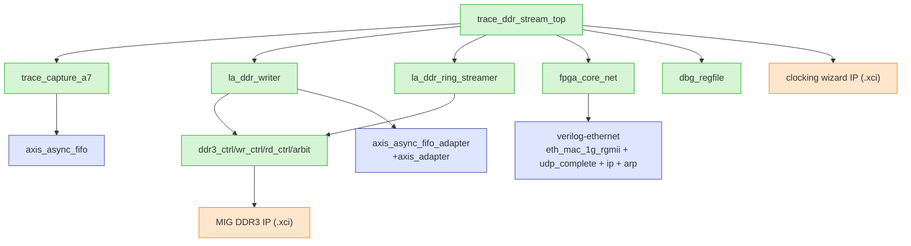
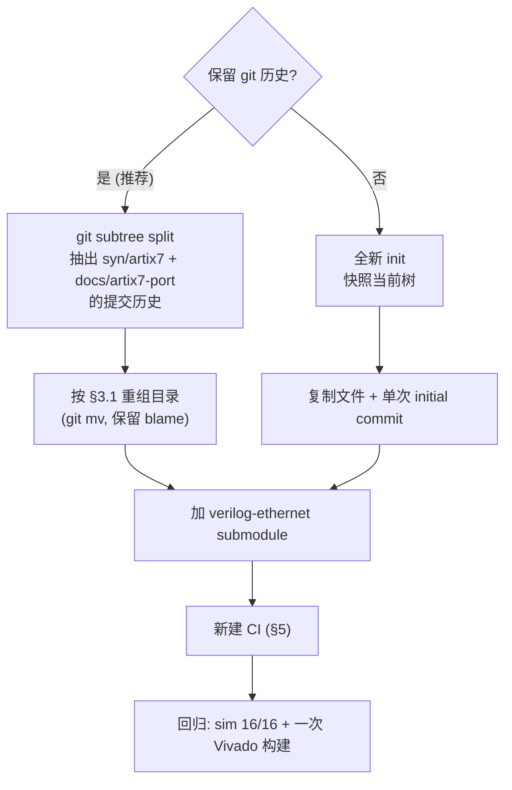
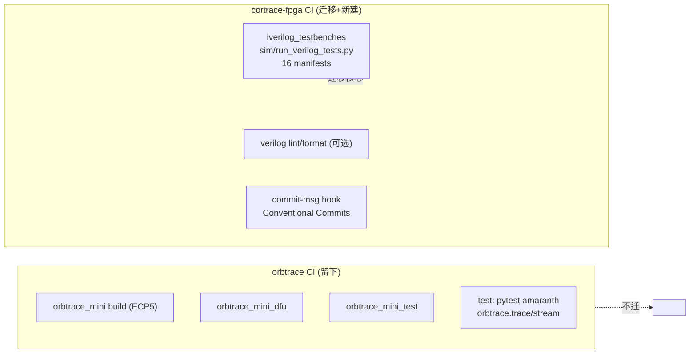
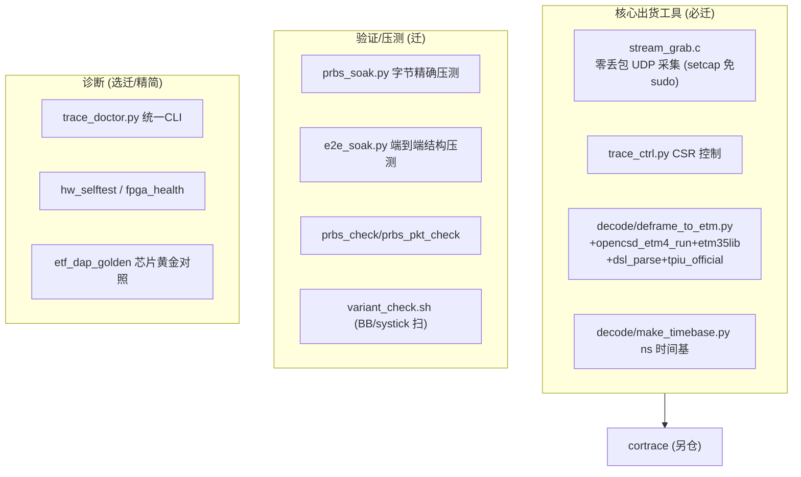
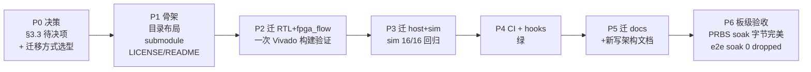

# cortrace-fpga 迁移方案设计

日期：2026-09-14
状态：设计稿（迁移尚未执行）

本文分析当前设计在 `orbtrace` fork 中的现状，论证独立成仓的必要性，并给出
一份可执行、保留历史、分阶段、可回退的迁移方案。**迁移是一次性大动作，本文
先定方案，执行前需确认。**

---

## 1. 这是什么

一套 **FPGA 采集 Cortex-M 并口 ETM trace** 的端到端工具链：



三个配套仓库：

| 仓库 | 角色 | 现状 |
|------|------|------|
| **cortrace-fpga**（本仓，新建） | FPGA 采集端 RTL + 主机采集/校验工具 | 待迁入 |
| **cortrace** | ETMv4 解码器（OpenCSD）+ callstack + Perfetto 导出 | 已独立成仓 |
| **stm32h743-etm-trace-firmware** | 被测目标固件（selftrace 确定性负载） | 已独立成仓 |

---

## 2. 现状：与 orbtrace 的血缘还剩多少

### 2.1 结论先行

**设计本体已与 orbtrace（ECP5 / LiteX / Amaranth）零代码共享。** 所有采集链
RTL、DDR 通路、主机工具、仿真、文档都是自研，目前只是寄生在 `orbtrace` fork 的
`syn/artix7/` 子目录里。留在原仓的代价：

- CI 仍在为不相干的 ECP5 `orbtrace_mini` 板打转（`if: github.repository ==
  'orbcode/orbtrace'`，fork 里根本不跑）
- 所有提交挤在别人项目的一个子目录，`(artix7)` scope 前缀是唯一区分
- Python 单测 `tests/` 全是 amaranth 的上游 `orbtrace.trace/stream`，与我们无关

### 2.2 依赖关系图



**唯一两条外部脐带**：
1. `verilog-ethernet`（MAC/UDP/AXIS 库）——第三方 MIT，本就是 submodule，随迁即可。
2. `verilog/traceIF.v`（orbtrace 的 TPIU 解帧）——**已不在出货数据通路**。出货走
   DDR raw 流 + PC 侧 `tpiu_official.py`（orbuculum 移植）deframe；只有废弃的
   `trace_probe_top.v` skeleton 还引用它。迁移时可弃用或移植一份最小实现。

### 2.3 出货数据通路的 RTL 依赖闭包（run_trace_ddr_stream.tcl）



绿=自研，蓝=verilog-ethernet 复用，橙=Xilinx IP（需随仓提供 `.xci` 或生成脚本）。

---

## 3. 迁移内容清单

### 3.1 迁入 cortrace-fpga（自研）

| 源路径（orbtrace 内） | 目标路径（cortrace-fpga） | 说明 |
|----------------------|--------------------------|------|
| `syn/artix7/rtl/` | `rtl/` | 采集前端（trace_capture_a7 等） |
| `syn/artix7/bringup/rtl/` | `rtl/` | 出货 top + DDR + 网络 + CSR |
| `syn/artix7/bringup/rtl/ddr3/` | `rtl/ddr3/` | DDR3 控制（含 MIG `.xci`）|
| `syn/artix7/bringup/fpga_flow/` | `fpga_flow/` | Vivado 构建 TCL |
| `syn/artix7/bringup/decode/` | `host/decode/` | deframe 前端（13 py + 测试）|
| `syn/artix7/bringup/scripts/` | `host/scripts/` | 采集/校验/诊断工具 |
| `syn/artix7/bringup/target/` | `host/target/` | openocd cfg |
| `sim/` | `sim/` | iverilog 框架 + manifests |
| `docs/artix7-port/` | `docs/history/` | ~130 篇设计/评审/复盘 |
| `syn/external/verilog-ethernet` | `rtl/external/verilog-ethernet` | submodule 随迁 |

### 3.2 留在 orbtrace（不迁）

- `orbtrace/` 根的 amaranth ECP5 设计、`tests/`（amaranth 单测）、`pyproject.toml`
- `verilog/traceIF.v` 等 orbtrace 原生 TPIU 逻辑（出货通路已不用）
- `.github/workflows/build.yml` 里的 `orbtrace_mini*` 三个 job

### 3.3 待决策项（迁移前定）

1. **traceIF.v**：确认出货通路彻底不依赖 → 不迁；`trace_probe_top` skeleton 一并弃用。
2. **Xilinx IP（MIG/clock `.xci`）**：随仓提交 `.xci`（Vivado 版本锁 2021.1），
   还是提供 `create_ip` 生成脚本。建议提交 `.xci` + 记录 Vivado 版本。
3. **`scripts/attic/` 与已退役诊断**：迁移时是否顺带清理（另起 commit）。
4. **`bringup/` 命名**：迁入后是否去掉 "bringup"（已不是 bring-up 阶段）。

---

## 4. 迁移方式：保留历史 vs 全新 init



**推荐 subtree split**：这几个月的排障史（130 篇评审复盘 + 逐 bug 的 commit）是
高价值资产，值得保留 blame/log。代价是历史里混着子目录路径，需一次目录重组。

subtree 命令骨架（**执行前确认，不在本稿运行**）：

```bash
# 在 orbtrace 里抽出两个子树的历史
git subtree split -P syn/artix7        -b split-rtl
git subtree split -P docs/artix7-port  -b split-docs
# 在 cortrace-fpga 里合入
git -C cortrace-fpga pull ../orbtrace split-rtl  --allow-unrelated-histories
# ...再 git mv 重组为 §3.1 布局
```

若嫌 subtree 目录重组繁琐，退而求其次：全新 init + 把 `docs/artix7-port` 作为
`docs/history/` 整体带入（丢 RTL 的逐行 blame，但保留文档）。

---

## 5. CI 方案（新仓）

orbtrace 的 CI 有两类，只有 Verilog 那类是我们的：



新仓 `.github/workflows/`：

| Job | 内容 | 来源 |
|-----|------|------|
| `sim` | `python3 sim/run_verilog_tests.py --coverage --junit` | 迁自 orbtrace `iverilog_testbenches` job |
| `hooks` | 校验 Conventional-Commit（可用现有 commit-msg hook） | 已有 |

去掉：`orbtrace_mini*`（ECP5）、`test`（amaranth pytest）——都不属于本项目。

**迁移后回归门槛**：`sim` 16/16 通过 + 至少一次 `run_trace_ddr_stream.tcl`
Vivado 构建出 bit + 一次板级 PRBS soak 字节完美。

---

## 6. 工具与文档盘点

### 6.1 主机工具（host/scripts + host/decode）现状分层



`decode/` 已从 105 精简到 13（cortrace 取代自研解码器，5 批已提交）。`scripts/`
仍有较多历史诊断，迁移时建议再过一遍：核心（采集/校验/压测）必迁，SI/眼图类
一次性诊断可归 `attic/` 或删。

### 6.2 文档

- `docs/artix7-port/` 下 ~130 篇：proposals（43）+ reviews（50+）+ stage3/4 复盘 +
  refs（ARM ETM spec PDF）。整体迁入 `docs/history/` 保留研发轨迹。
- **新写**：`docs/` 根需要 README/架构/快速上手/CSR 手册/构建指南（当前散在
  各 stage 文档里，独立成仓后应收拢成正式文档）。
- refs 里的 ARM spec PDF 有版权，迁移沿用现有 `.gitignore` 策略（不入库，本地放）。

---

## 7. 分阶段执行计划（建议）



每阶段独立可回退；P2/P3 各设明确验收（构建出 bit / sim 全绿）后再进下一步。

---

## 8. 命名与定位

- 仓名：**cortrace-fpga**（已建）。与解码器 `cortrace` 成套：`cortrace-fpga` 抓 →
  `cortrace` 解，工具链自解释。
- 一句话定位：*An Artix-7 FPGA appliance that captures a Cortex-M parallel ETM
  trace port and streams it over gigabit UDP for cortrace to decode.*

---

## 9. 风险与回退

| 风险 | 缓解 |
|------|------|
| Xilinx IP（MIG/clock）版本绑定 | 提交 `.xci` + 锁 Vivado 2021.1，README 注明 |
| subtree 历史重组出错 | 在临时分支操作，验证后再定；orbtrace 原仓不动作为回退 |
| traceIF 依赖遗漏 | 迁移前 grep 确认出货 tcl 闭包不含 traceIF（已确认）|
| 板级回归环境（NIC/openocd/setcap） | 迁移 AGENT.md 里的环境约定 + setcap 说明 |
| verilog-ethernet submodule commit 漂移 | pin 当前 commit（77320a9）|

迁移全程 orbtrace 原仓保持不动，任何阶段失败都可回退到"继续用 orbtrace 子目录"。
