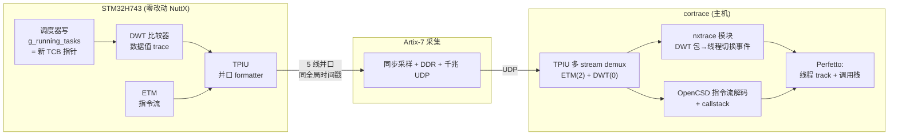
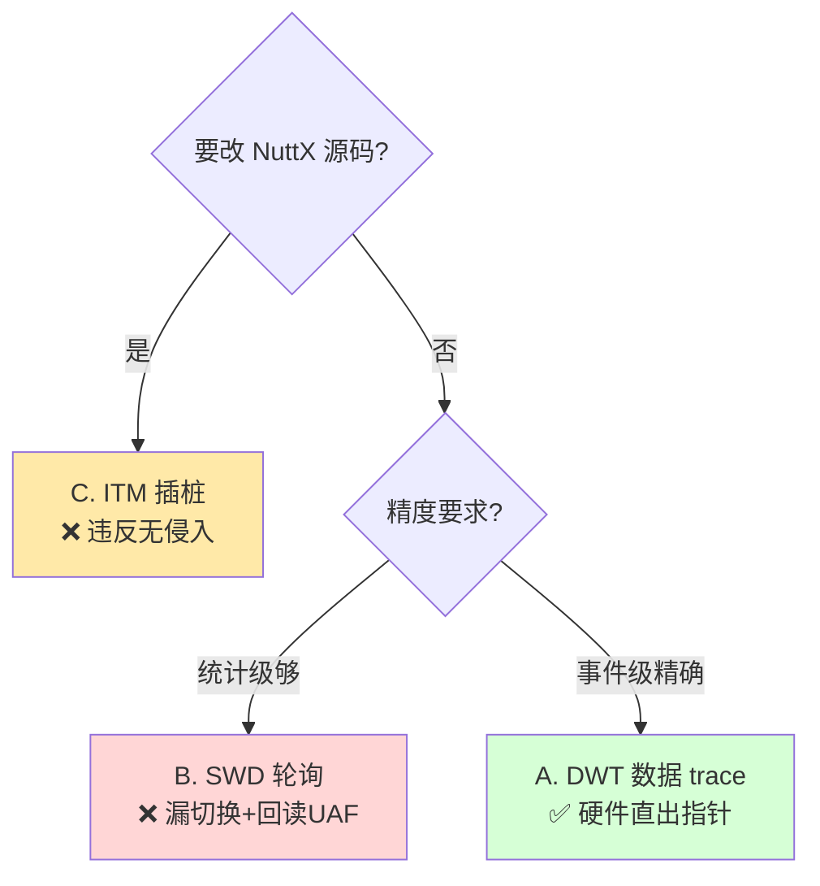
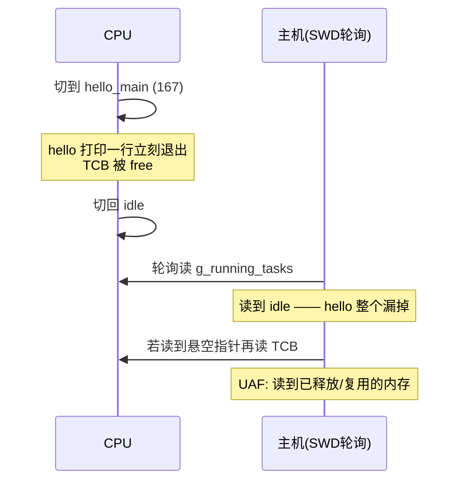
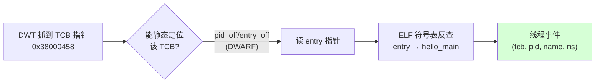
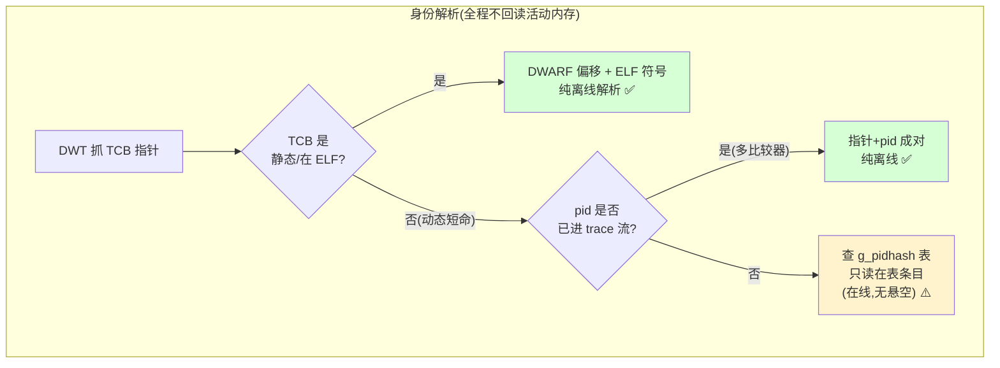
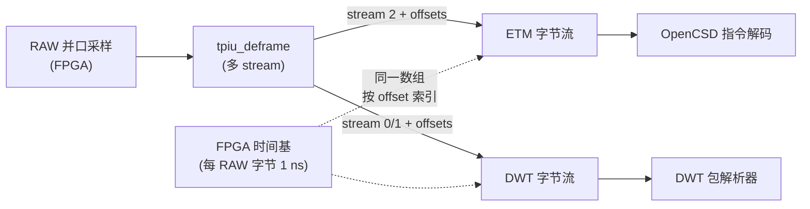
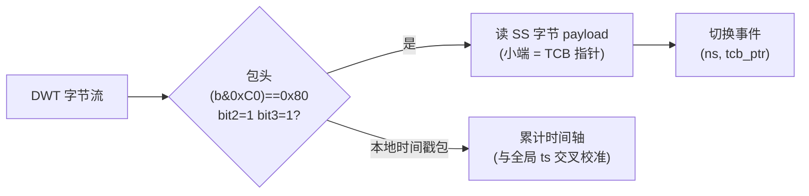
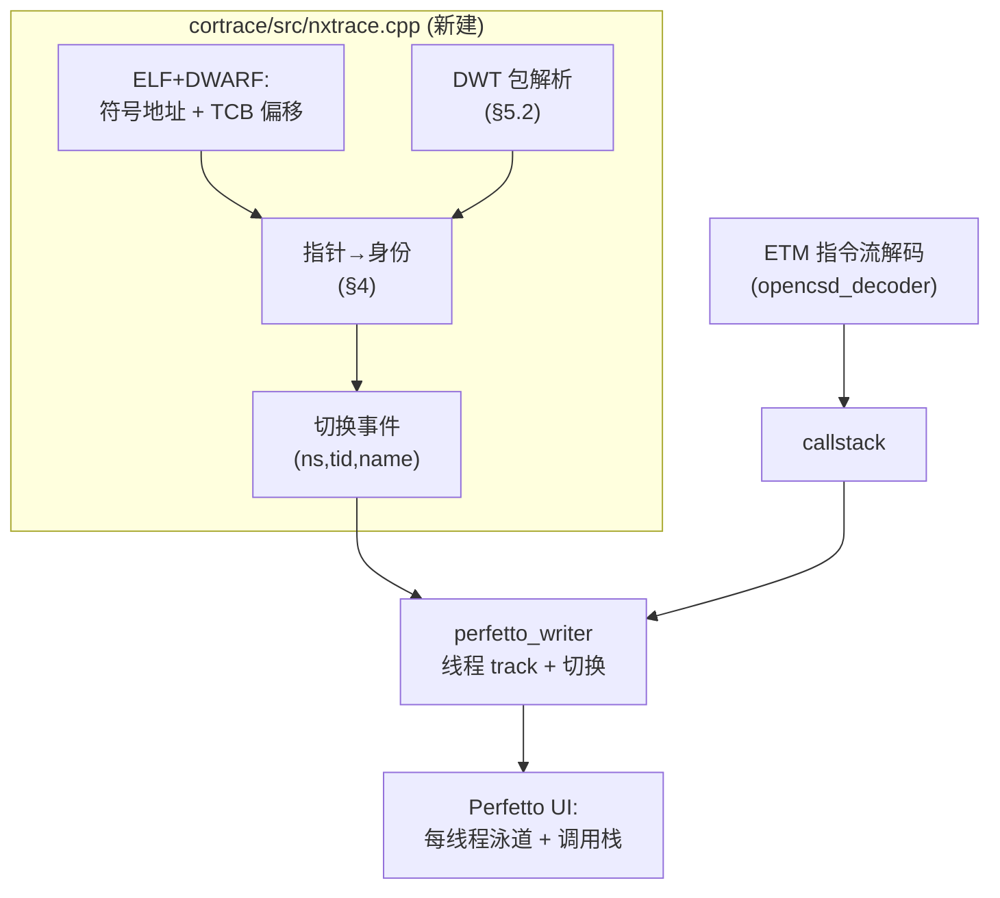
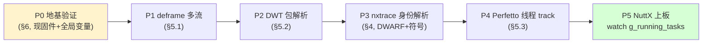

# NuttX 无侵入 · 无 UAF 线程性能打点方案设计

日期：2026-09-14
状态：设计稿（地基验证待执行）
适用平台：STM32H743（Cortex-M7，ETMv4）+ Artix-7 并口 trace 采集 + cortrace 解码

---

## 0. 一页纸结论

在**不改一行 NuttX 代码**、**不停 CPU**、**不产生 UAF**（use-after-free）的前提下，
把 RTOS 线程切换事件精确地叠加到 cortrace 的函数级时间线上，让 Perfetto 里既能
看指令流调用栈、又能看"哪个线程在跑"——达到 TRACE32 OS-awareness 的效果，
但硬件只是一块 Artix-7 + 廉价并口。



三条设计支柱：

1. **无侵入**：DWT 比较器监控内核写 `g_running_tasks`，硬件把"写入的新 TCB 指针"
   直接打进 trace 流，主机不回读目标内存。
2. **无 UAF**：TCB 指针由硬件在写发生的瞬间捕获（不丢短命线程）；线程身份
   （pid/优先级/名字）离线用 **ELF+DWARF 静态解析**，绝不在运行时按可能已释放的
   指针回读活动内存。
3. **同流同时钟**：ETM 与 DWT 走**同一条并口 TPIU**、盖**同一个全局时间戳**，
   两路数据天然对齐——这是并口平台相对 F429 SWO 混流方案的根本优势。

---

## 1. 问题定义

cortrace 现在能把 ETM 指令流还原成函数级调用栈时间线（周期级精度，见
`cortrace` 的 CCI cycle-count）。缺的一环是**线程维度**：一段 trace 里，
`nsh_main`、`hello_main`、idle 交替运行，调用栈需要归属到"当时在跑的线程"，
否则 Perfetto 里所有函数都堆在一条 track 上，无法按线程分泳道、无法统计
每线程 CPU 占用。

要素约束（用户明确要求）：

| 约束 | 含义 |
|------|------|
| **无侵入** | 不改 NuttX 源码、不占用内核 CPU 周期、不改 TCB 结构体 |
| **无 UAF** | 不在事件事后回读可能已被 `free` 的 TCB 内存 |
| 精确 | 事件级（每次切换都抓到），不是统计级轮询 |
| 对齐 | 线程事件与指令流共用同一时间基准 |

---

## 2. 方案选型：三种线程切换追踪方式

来自 TRACE32 逆向（`t32/docs/trace_system_summary_v2.md` §3.1/§3.3）与 H743 实测
（`orbtrace/docs/swo-trace-sidetrack/h743-dwt-thread-trace/`）的收敛结论：

| 方案 | 侵入性 | 精度 | UAF 风险 | 硬件前提 | 判定 |
|------|:------:|:----:|:--------:|---------|:----:|
| **A. DWT 数据 trace** | 零 | 事件级精确 | 可消除（见 §4） | DWT 比较器 + trace 出口 | ✅ **选定** |
| B. SWD/DAP 后台轮询 | 零 | **统计级，必漏切换** | 高（回读时 TCB 可能已释放）| 仅 SWD | ❌ 会漏、会 UAF |
| C. 极轻 ITM 插桩 | 微（改内核）| 事件级精确 | 低 | ITM + 1 stimulus | ⚠️ 违反"无侵入" |

选 **A（DWT 数据 trace）**：唯一同时满足"零侵入 + 事件级精确"的方案。



### 2.1 为什么不是 ContextID trace（CONTEXTIDR 路线）

理论最优路线是让 ETM 在指令流里内嵌 ContextID（写 `CONTEXTIDR` 时 ETM 自动发
Context 包，OpenCSD 原生支持按 ContextID 分线程）。**但已被硬件否决**：

> H743 ETMv4 上板实测 `TRCIDR2.CIDSIZE = 0` —— 该 ETM **不实现 ContextID trace**。
> （见历史结论，与 TSSIZE=8 支持 64bit 时间戳、CCI=1 支持 cycle count 并列。）

所以 ContextID 路线在本芯片不可用，退回 DWT 数据 trace。

### 2.2 为什么 SWD 轮询会 UAF（关键）

方案 B 的机制是主机周期性通过 SWD 读 `g_running_tasks` 拿当前 TCB 指针，再按指针
读 TCB 的 pid/name。两个致命问题：



- **漏切换**：两次采样之间的切换看不见（统计级）。
- **UAF**：短命线程的 TCB 在主机回读时可能已 `free`，读到垃圾。

方案 A 从根上避免：硬件在**写发生的那一刻**就把写入值（新 TCB 指针）编码进 trace 流，
主机只解析流里已有字节，不回读活动内存。

---

## 3. 无侵入：DWT 监控 g_running_tasks

### 3.1 原理

DWT（Data Watchpoint and Trace）比较器可配成"命中对某地址的**写**访问时，产生一个
**数据值 trace 包**，payload 即被写入的值"。把比较器地址设为 `g_running_tasks`，
每次调度器切换线程写入新 TCB 指针时，DWT 硬件自动发一个带该指针的 trace 包。


> H743 的 DWT/ITM 等 trace 组件挂在**系统总线地址 `0xE00xxxxx`（CPU 视角）**，且
> 配置前须先经 DBGMCU 使能 trace 时钟。具体寄存器序列见 §7。

### 3.2 与 F429 SWO 支线的差异（为什么并口是"正解平台"）

| 维度 | F429 SWO（支线，已验证）| **H743 并口（本方案）** |
|------|------------------------|------------------------|
| DWT 包出口 | SWO 单线（NRZ）| 并口 TPIU（与 ETM 同口）|
| ETM + DWT 混流 | ❌ F429 Simple TPIU 不能混流 | ✅ 标准 TPIU 多 stream，天然分流 |
| 时间对齐 | SWO 本地时间戳，与 ETM 难协议级对齐 | **同一全局时间戳**，协议级对齐 |
| 带宽 | 低（够 DWT，不够满速 ETM）| 高（ETM 满速 + DWT 富余）|

DWT 数据 trace 本身在 F429 SWO 上已实测跑通（短命 `hello_main` 稳定捕获，见参考
文档 §7.2 铁证）。本方案把同一机制搬到 H743 并口，收获"与 ETM 同流同时钟"。

---

## 4. 无 UAF：身份解析走 ELF 静态解析

DWT 只给出 TCB **指针**。线程身份（pid / 优先级 / 状态 / 名字）需要从该指针
解析。**绝不在运行时回读活动内存**（那正是 UAF 来源）。分两层：

### 4.1 结构布局来源：DWARF（本 ELF 无 g_tcbinfo）

这版 NuttX **没有编译进 `g_tcbinfo`** 自描述元数据（已确认符号表无此符号）。
但 ELF 带完整 DWARF（`.debug_info` 等），字段偏移可静态解出。**实测本 ELF**
（`nuttx_test/nuttx/nuttx`，via `gdb-multiarch`）：

| 字段 | 偏移 | 类型 | 用途 |
|------|:----:|------|------|
| `pid` | `0x30` | `pid_t`（int32）| 线程 id |
| `sched_priority` | `0x34` | uint8 | 优先级 |
| `task_state` | `0x40` | tstate_t | 运行/就绪/阻塞 |
| `entry` | `0x3C` | union{main,pthread} | **线程名来源**（见 §4.2）|
| `flags` | `0x44` | uint32 | 任务/线程标志 |
| `sizeof(struct tcb_s)` | `168` | — | 校验用 |

> **无 `name` 字段**：本配置 `CONFIG_TASK_NAME_SIZE=0`，TCB 里没有内嵌线程名。
> 所以名字不能从 TCB 读，改用 §4.2 的 entry 符号法。

nxtrace 用 DWARF 动态解析这些偏移（版本自适应），不硬编码。若将来某版编进了
`g_tcbinfo`，可优先读它（更省事），DWARF 作后备。

### 4.2 线程名：entry 指针 → ELF 符号

既然没有 `name` 字段，线程名从 `entry`（线程入口函数指针）反查 ELF 符号表：
`entry=0x08001234` → `addr2line`/符号表 → `hello_main`。这是**纯静态查表**
（ELF 符号表），与运行时内存无关，天然无 UAF。



### 4.3 pid 也进流：多比较器彻底消除 UAF（可选增强）

上面的"按 TCB 指针静态解析"对**静态/长生命周期 TCB**（idle、nsh、静态创建的
任务）完全无 UAF——它们的 TCB 地址在 ELF/内存里稳定，指针→身份可离线定位。

但**动态创建的短命线程**，其 TCB 是运行时 `malloc` 的，地址不在 ELF 里，光有
指针无法离线知道 pid/name。此时有两条无 UAF 的路：

- **路 1（推荐，纯离线）**：再配一个 DWT 比较器 watch `g_running_tasks` 切换点
  附近对 TCB 内 `pid` 字段的写，或在切换序列里让 pid 也进流。这样"指针 + pid"
  成对出现在 trace 流，pid 是硬件抓的瞬时值，不依赖事后回读。
- **路 2（在线但无 UAF 窗口）**：仅对**流里出现过、且此刻仍在 `g_pidhash` 表中**
  的 TCB，通过 SWD 读一次身份并缓存。`g_pidhash`（@0x240003dc，`struct tcb_s **`）
  + `g_npidhash`（@0x240003e0）构成 pid→TCB 映射；只读仍在表中的条目可避免
  悬空指针。代价是需要在线连接，不是纯离线。

> 离线纯 trace 场景优先"路 1"。多比较器 H743 DWT 支持（比较器数量见
> `DWT_CTRL.NUMCOMP`，上板确认）。



---

## 5. cortrace 侧：nxtrace 解码模块

### 5.1 多 stream demux（前置改造）

现状：`tpiu_deframe(data, want_stream, ...)`（C++ `deframe.cpp` / Python
`tpiu_official.py`）一次只提取**一个** stream（出货用 `want_stream=2` 取 ETM）。
DWT 数据包走另一个 stream（ITM/DWT 单元的 trace ID，通常 stream 0/1）。

改造：让 deframe 一趟demux出**多个** stream，各自带 RAW 字节偏移（时间基），
使 ETM 流与 DWT 流索引到同一 FPGA 时间基数组：



接口草案（保持向后兼容：`want_stream<0` 仍可取单流）：

```cpp
// deframe.hpp —— 新增多流版本，返回 stream_id -> {bytes, src_offsets}
struct MultiDeframeResult {
    std::map<int, std::vector<uint8_t>>   streams;      // stream_id -> bytes
    std::map<int, std::vector<uint64_t>>  src_offsets;  // 每字节的 RAW 偏移
    std::size_t frames, syncs, async_count;
};
MultiDeframeResult tpiu_deframe_multi(const std::vector<uint8_t>& data,
                                      const DeframePhase& phase);
```

### 5.2 DWT 数据值包解析器

DWT 数据值写包（ARMv7-M ARM, DDI0403E, Table D4-7）：包头 `(b & 0xC0)==0x80`
且 bit2=1（硬件源）、bit3=1（写），后跟 SS 指示的 payload 字节数（TCB 指针=4 字节，
小端）。比较器号在 CMPN[5:4]。解析出 `(comp_id, written_value)`：



> 时间：并口方案下每个 RAW 字节已有 FPGA 全局时间基（ns），DWT 包的 ns 直接取
> 其源字节偏移对应的时间——**与 ETM 同一把尺子**。DWT 自身的本地时间戳包用于
> 交叉校准/查漏，不作主时基。

### 5.3 事件 → Perfetto 线程 track

nxtrace 把解析出的切换事件序列（`ns, tcb_ptr → pid, name`）转成 Perfetto 的
线程调度信息：每个线程一条 track，指令流的函数调用栈按"当前线程"归属到对应
track。复用 cortrace 已有的 Perfetto 导出（`perfetto_writer.cpp`）。



CLI 草案（沿用现有风格，`--elf` 已存在）：

```
cortrace_decode --raw <capture.bin> --elf <nuttx> \
                --nx-switch-stream 0 \        # DWT 所在 stream
                --nx-running-tasks 0x240003bc \  # 可选,默认从 ELF 符号取
                -o out.perfetto
```

---

## 6. 地基验证计划（不依赖装 NuttX）

在写 nxtrace 之前，先用**当前 H743 固件 + 一个全局变量**验证"并口能同时载 ETM
和 DWT 数据包、且时间戳对齐"这一地基。这一步与 NuttX 无关，纯验平台能力。


| 步骤 | 验收 |
|------|------|
| ① 固件：加 DWT 比较器 watch 一个测试全局变量，主循环周期写入递增值 | 寄存器读回正确 |
| ② 抓流 | 0 dropped（沿用现有链路指标）|
| ③ cortrace demux 出 ETM(stream2) + DWT(streamN) | 两路都非空 |
| ④ DWT payload 小端解出 == 固件写入的递增值；DWT 事件 ns 落在 ETM 时间轴内 | 值吻合、ns 对齐 |

通过后再进 NuttX：把测试全局变量换成 `g_running_tasks`，接入 §4/§5。

---

## 7. 关键寄存器（H743，CPU 视角 0xE00xxxxx）

> 与 SWO 支线共用同一套 DWT/ITM 编码，差别在出口走并口 TPIU（多 stream）而非 SWO。
> 上板配置必须**运行态**操作（reset-halt 会读到上电默认值）。

| 组件 | 寄存器 | 地址 | 值/说明 |
|------|--------|------|---------|
| DBGMCU | CR | `0x5C001004` | 使能 trace 时钟（TRACECLKEN）|
| DWT | COMP0 | `0xE0001020` | = `&g_running_tasks`（0x240003bc）|
| DWT | MASK0 | `0xE0001024` | `0`（精确地址匹配）|
| DWT | FUNCTION0 | `0xE0001028` | `0x0D`（数据值写包；**非** 0x07 watchpoint 会停机）|
| ITM | TCR | `0xE0000E80` | 使能 ITM + 时间戳 + 同步 |
| ITM | LAR | `0xE0000FB0` | 解锁 `0xC5ACCE55` |
| TPIU | — | `0xE0040xxx` | 并口模式（非 SWO），formatter on 多 stream |

（DWT 数据值写包头 `0x8F`、本地时间戳包等编码详见参考文档 §3。）

---

## 8. 与现有工作的衔接

| 复用 | 位置 |
|------|------|
| TPIU deframe（want_stream 语义）| `cortrace/src/deframe.cpp`、`cortrace-fpga/host/decode/tpiu_official.py` |
| FPGA 全局时间基（每 RAW 字节 1 ns）| `cortrace-fpga/host/decode/make_timebase.py` |
| ETM 指令解码 + callstack | `cortrace/src/opencsd_decoder.cpp`、`callstack.cpp` |
| Perfetto 导出 | `cortrace/src/perfetto_writer.cpp` |
| ELF 直读（PT_LOAD 段）| cortrace `add_elf()`（已有）|
| **新建** | `cortrace/src/nxtrace.cpp`（DWT 包→线程事件）+ deframe 多流改造 |

---

## 9. 实施路线



每步独立可验、可回退。P0 通过前不写解码代码；P5 前所有解码逻辑用地基验证的
合成数据打通。

---

## 10. 风险与对策

| 风险 | 对策 |
|------|------|
| 动态短命线程 TCB 不在 ELF，指针无法离线解身份 | §4.3 路 1：多比较器让 pid 也进流（纯离线）|
| DWT 比较器数量不足（ETM 地址过滤 + 线程 watch 抢比较器）| 上板读 `DWT_CTRL.NUMCOMP` 确认；本方案指令-only ETM 不占地址比较器 |
| DWT 包与 ETM 抢并口带宽 | 线程切换是低频事件（每次 4~5 字节），相对满速 ETM 占比极小 |
| 无 `g_tcbinfo`，偏移随 NuttX 版本变 | DWARF 动态解析（版本自适应），不硬编码 |
| 无 `name` 字段 | entry 指针反查 ELF 符号（§4.2）|
| ContextID 路线不可用 | 已由 `TRCIDR2.CIDSIZE=0` 否决，本方案不依赖 |

---

## 附：本 ELF 实测符号与偏移（nuttx_test/nuttx/nuttx）

内核符号（`arm-none-eabi-nm`）：

| 符号 | 地址 | 类型 |
|------|:----:|------|
| `g_running_tasks` | `0x240003bc` | per-CPU 当前任务 |
| `g_readytorun` | `0x240003b4` | 就绪链表头 |
| `g_pidhash` | `0x240003dc` | `struct tcb_s **`（pid→TCB）|
| `g_npidhash` | `0x240003e0` | 哈希表大小 |
| `g_tcbinfo` | — | **不存在**（本版未编入）|

TCB 字段偏移（DWARF，`gdb-multiarch`）：pid@0x30 · sched_priority@0x34 ·
entry@0x3C · task_state@0x40 · flags@0x44 · sizeof=168 · **无 name 字段**。

ELF：ARM EABI5、hard-float、含完整 `.debug_info`/`.debug_str`/`.debug_line`。

---

## 11. 上板进展（P0/P5，2026-09-15）

按 §9 路线上板推进，记录实测结论与踩坑。**ETM 指令流链路已在 NuttX 上端到端
跑通；DWT 线程切换数据包发射尚未解决**（一个孤立的 deframe/发射问题）。

### 11.1 已验证（上板实测）

- **主频降到 150MHz**（寄存器实证：`RCC_PLL1DIVR=0x05030677` → N=120/P=4/R=6，
  VCO 600、sysclk 150、TRACECLKIN 100 → TRACECK 引脚 50MHz；`RCC_PLLCKSELR` M=5）。
  HCLK 75MHz，与裸机操作点一致。改动只在 `board.h`（N/P/R 三个数），采集侧不变，
  仅 decode 的 `--sysclk-hz` 从 400M 改 150M。
- **WFI idle 是关键**。NuttX 通用 `arm_idle.c` 的 WFI 被 `#if 0` 注释，idle 任务
  空转被 ETM 全量记录：一次 3s 抓取里 `nx_start` 有约 **1680 万条指令段**，打满
  50MB/s 端口、溢出 ETF（opencsd 中途 fatal）。加 board 自定义 `up_idle`（WFI，
  经 `CONFIG_ARCH_IDLE_CUSTOM`）后，ETM 载荷 **132MB → 98KB**（约 1350×）。
  > 坑：NuttX make 不追踪 `Make.defs` 的 `ARCH_IDLE_CUSTOM` 变化，必须手动删
  > 旧的 `arm_idle.o`/`libarch.a` 才会重链（头/Make.defs 依赖跟踪弱——改这类
  > 文件后一律 `rm` 对应 .o）。
- **NuttX ETM 解码干净**：98KB、begins/ends 配平（12826/12826）、0 dropped、
  35 函数、295 异常（SysTick/调度）、cycle count + ETM 时间戳齐全。指令流 +
  调用栈这条链在 NuttX 上完全可用。
- **heartbeat 内核线程**（20ms 睡眠循环，`CONFIG_NUCLEO_H743ZI_NXTRACE_HEARTBEAT`）
  在无调试器连接时持续产生 idle↔线程切换——必要，因为 NSH 控制台走 RTT，而连
  调试器抓 RTT 会清掉 DWT 比较器。
  > 坑：`CONFIG_PTHREAD_STACK_MIN` 未定义 → 栈大小 0 → HardFault 死在
  > `stack_dump`；改用写死 1024 字节栈修复。

### 11.2 未解决：DWT 数据值包没出来

DWT 比较器确实在匹配（`DWT_FUNCTION0` 读回 `0x0100000d`，g_running_tasks 被写
时 bit24 MATCHED 置位），ITM/DWT ATB 也确实到达并口 TPIU（stream 1 非空；关掉
ITM 后 stream 1 变 0 字节，证明 stream 1 是真 ITM 输出）。**但** deframe 出的
stream 1 是刚性周期重复 `88 7a c0 ff`，几百字节零变化——既不是预期的 `0x8F` 头
数据值写包（应含 TCB 指针 `0x2400xxxx`），也不像会变化的本地时间戳。

关键观察：

- SWO 参考（`orbtrace/.../h743-dwt-thread-trace`）用**同样**的 DWT 配置
  （FUNCTION=0x0D、MASK=0）能解出 `0x8F` TCB 指针包——但走的是**单流、
  formatter-OFF** 的 SWO TPIU。
- 本方案是**并口、formatter-ON、多流**（ETM ID2 + ITM/DWT ID1）。
- 补上固件遗漏的 `ITM_TER=0xFFFFFFFF` + `ITM_TPR=0`，结果不变。
- 关掉 ITM，stream 1 为空（所以周期字节是 ITM 来源，非 formatter 填充）。

### 11.3 首要怀疑与下一步

1. **deframe 错误重构 stream 1**（首要）。TPIU deframer（`deframe.cpp`）只在
   ETM stream-2 路径上验证过；它的 `lowbits` 合并逻辑在 ID1（稀疏 ITM）与 ID2
   （ETM）共享同一 16 字节帧、交错出现时可能在帧边界错切，把 DWT 包搅成这个
   周期模式。下一步：抓原始 TPIU 帧，按 orbuculum `_getPacket` 语义手工解 ID1
   字节，确认 deframe 之前线上是否真有 `0x8F` 包——以此区分"线上就没有" vs
   "deframe bug"。
2. **ITM 丢了 DWT 载荷、只留时间戳**。ATB 顶不住时 ITM 可能发了跟随 DWT 包的
   LTS、却丢了 DWT 数据字节。测：降切换频率 / 提 ETM 同步周期；查 ITM overflow。
3. **是解析器的判别位/长度搞错**，非流本身。`88 7a` 可能是被临时脚本错误定长
   的合法包。测：用 orbuculum/orbetto 的 ITM 解码器跑这些字节，而非临时解析。

§9 路线状态：**P0 部分达成**（ETM 多流采集 + 干净解码验证；DWT 数据值包待解）；
P1 deframe 多流改造需连带修 §11.3(1) 的 ID1 重构问题。

### 11.4 裸机对照实验：排除 NuttX，锁定为架构/路由问题（2026-09-15）

为排除 NuttX 干扰，把裸机固件 boot 默认改成 `WL_SELFTRACE + dwt=1`：固件**冷启动
自己 arm DWT 比较器**（watch `g_dwt_probe`，每次迭代写递增值），**全程无 openocd、
无 NuttX、无 CLI**，配置完全可控。

结果（`stream_grab` 2s，纯固件）：stream 1 **仍然只有 `c0 ff 88 7a`（255/136/122/192
各 150 个），0 个 `0x8F` 数据值包**。ITM_TCR 读回 `0x0001000f` 证明固件的 DWT+ITM
配置块确实执行了（这正是 `ITM_TCR_DWT_ATB` 的值），ITM 转发已开。

**结论（决定性）：不是 NuttX 问题，也不是 arm 时序问题。** 固件明确跑了和 SWO 参考
完全相同的 DWT(FUNCTION=0x0D)+ITM(TXENA) 序列，ITM 时间戳能到并口 TPIU，但 DWT
**数据值包就是不出来**。SWO 参考能成功的差别在于：它走 **SWTF（SWO trace funnel，
`0x5C004000`）+ formatter OFF**；而并口走 **CSTF（`0x5C013000`）→ ETF → TPIU +
formatter ON**——**两个不同的 funnel**。

强烈指向：**STM32H743 上 CM7 的 DWT/ITM 数据值包只接到 SWO 的 SWTF，没有接到并口这条
CSTF/ETF 路径**（时间戳/同步包能过，是因为它们由 ITM 在另一处生成，或 formatter 自身
产生；而 DWT 数据 trace 载荷没有被路由过来）。这是芯片 trace 互联的拓扑限制，非配置错误。

### 11.5 数据手册核查：并口路径存在，无需加线（2026-09-15）

查 RM0433 §60（debug infrastructure）+ ARMv7-M ARM（DDI0403E）确认拓扑，**结论有利**：

- **RM0433 §60.5**：`CSTF` 有两个 ATB slave 口，**S0 = Cortex-M7 ETM，S1 = Cortex-M7 ITM**。
  `ETF` 明确"captures trace data from two trace sources, namely the ETM and ITM"。
  还有一个 **trace bus replicator**"branches the trace bus from the CPU's ITM
  CoreSight component to **ETF and SWO**"——即 ITM/DWT **同时**送到 ETF（→并口 TPIU）
  和 SWO。**所以 DWT/ITM 到并口 TPIU 的物理路径存在，不用加线。**
- **ARMv7-M**：`DWT_CTRL.NOTRCPKT`（bit24）上板读 = 0 → DWT **支持** trace 包（不是
  UNPREDICTABLE 情形）；`NUMCOMP`=4；FUNCTION=0x0D（数据值写包）编码正确。ITM
  转发（TXENA）已开、时间戳能到并口——证明 S1(ITM)→ETF→TPIU 这条 ATB 通。

**矛盾收窄**：路径存在、DWT 硬件支持、配置正确、ITM 时间戳能过并口，但 DWT **数据值
包**就是不过。与 SWO 参考的唯一结构差异是 **SWO 走 SWTF + formatter OFF**，并口走
**CSTF→ETF + formatter ON**。剩余嫌疑（按可能性）：

1. **CSTF 仲裁优先级**：S0(ETM) 与 S1(ITM) 的 `PRIPORT` 优先级。手册明确"高优先级应给
   数据量小的源"。若 ETM(S0) 优先级 ≥ ITM(S1)，ETM firehose 会饿死 ITM 的 DWT 数据包
   （而周期性时间戳恰好在 ETM 间隙挤出来）。**下一步试：抬高 S1 优先级 / 压低 ETM 产量
   （已 WFI idle）后看 DWT 包是否出现。**
2. **ETF/replicator 对 ITM 数据包的处理**：replicator 或 ETF 在 formatter-on 下可能只
   放行部分 ITM 包类型。
3. **我的 C++ deframe 对 ID1(稀疏 ITM)流的重构**：仍未用参考 python deframer 对拍排除。

### 11.6 决定性实验：DWT 数据值包不经并口 TPIU（2026-09-15，已定论）

用**串口自回读**破了 openocd 清 DWT 的死结：固件 arm DWT 后从 UART 打印自己锁存的
寄存器（CPU 自读，openocd 没机会清）。实测（裸机，`board.sh uart-reset`）：

```
[dwt] CTRL=0x40000001 COMP0=0x20000400 MASK0=0 FUNC0=0x0100000d ITM_TCR=0x0001000f
```

`FUNC0=0x0100000d` → bit24 MATCHED **置位**：**DWT 确实 arm 成功且正在命中**。固件侧
100% 正常，彻底排除"固件配置/arm 时序"嫌疑。

再做隔离实验：**ETM 完全关掉**（`TRCPRGCTLR=0`）、只留 DWT+ITM，消除 ETM firehose
与 ETF 溢出。抓取（`board.sh grab`）：stream 2 = 0 字节（ETM 确已关），**stream 1 仍
然 0 个 `0x8F` 数据值包**，只有周期 `c0 ff 88 7a`（ITM 本地时间戳，301 字节）。

**结论（airtight）：STM32H743 上 DWT 数据值包不经并口 TPIU（CSTF→ETF）路径**——
即便 ETM 全关、DWT 确认 arm 且命中，数据值包也到不了并口线上；只有 ITM 本地时间戳
能过。DWT 命中会触发一个时间戳（所以 `c0 ff 88 7a` 出现），但**数据值 payload 本身
在上线前被丢弃**。RM0433 说 replicator 把 ITM 分叉到 ETF+SWO，但经验上 **DWT 数据
trace 这一类包只走到 SWO/SWTF 分支，没进 ETF/并口分支**（ETF 在 HW-FIFO 模式或 M7
trace 互联只把 timestamp/指令类包送 ETF）。

**最终方案（不加并口线）：**
- **DWT 线程切换走 SWO 单线**（SWTF，`orbtrace/.../h743-dwt-thread-trace` 已实测能出
  `0x8F` TCB 指针包，DAPLink 即可，**复用已有 SWO/PB3，非并口加线**）。
- **ETM 指令流 + callstack 走并口**（CSTF/ETF/TPIU，本轮已在 NuttX 上验证干净）。
- 主机侧 cortrace 用 ETM cycle-count / 全局时间戳把两路对齐（周期级）。牺牲"同一物理
  流"，但两路都确定可用，且零额外并口引脚。
- **备选（纯并口、零 SWO）**：只用 ETM 侧推断线程切换（exception/PC + 调度器函数进入
  点），nxtrace 逻辑更复杂但一根线不加。

§9 路线更新：P0 定论——DWT 走并口此芯片不可行，改 SWO 旁路；P1+ 的 nxtrace 按
"ETM(并口) + DWT(SWO) 双出口 + 主机对齐"设计。

---

### 11.7 更正：§11.6"DWT 走并口不可行"结论有误，根因是 CSTF 端口配错（2026-09-16）

**本节推翻 §11.4/11.5/11.6 的核心结论。** 用 pymupdf4llm（比 pdftotext 可靠得多，
位域/连接表抽取干净）重新啃 RM0433 §60 的**框图与寄存器表**，配合原始矢量图核对，
坐实了并口路径可用，之前的"拓扑墙"是配置错误造成的假象。

**手册证据（RM0433 Rev 8）：**

- **Figure 827《Block diagram of debug infrastructure》（§60.3.1, p.3075）**：
  `ITM → Replicator`，replicator **两个输出分别接 CSTF 和 SWTF**（CoreSight
  replicator 语义为 1 入 2 出，把 ITM 的 ATB 复制两份）。`ETM → CSTF`。
  即 ITM/DWT 在拓扑上**同时**通往并口（CSTF→ETF→TPIU）和单线（SWTF→SWO）。
- **§60.5.4 Trace funnel (CSTF)（p.3135）白纸黑字**：
  > The slave ports are connected as follows:
  > - S0: Cortex-M7 ETM
  > - S1: Cortex-M7 ITM

  且 `CSTF_CTRL`（offset 0x000，复位值 0x0000_0300）：bit0=`ENS0`、bit1=`ENS1`，
  **复位时两口都未使能**；`CSTF_PRIORITY`（offset 0x004，复位 0x0000_0688）：
  `PRIPORT0[2:0]`=S0 优先级、`PRIPORT1[2:0]`=S1 优先级，0=最高、7=最低。
- **Figure 828《Power domains》（§60.3.3, p.3077）**：`CSTF/ETF/TPIU` 在 **D1 域**，
  `SWTF/SWO` 在 **D3 域**。正文："D1 power domain … needs to be on whenever a trace
  functionality is active on the processor"（core 一跑就有电）；"D3 power domain is
  always considered to be on when the debugger is connected"（**没调试器 D3 掉电**）。
  → 并口路径不依赖调试器；**SWO 反而天生依赖 debug 域供电**（解释了 SWO side-track
  里"接 openocd 抖几下、断开就停"的现象）。

**§11.6 实验为何得出错误结论：** 那次隔离实验的固件把 CSTF 使能写成了
`ENS1 | ENS2`（见当时的 `etm_regs.h`），但 **H743 的 CSTF 只有 S0/S1 两个 slave 口，
根本没有 S2**；ITM 是 **S1**。所以实验实际上**从未正确使能 ITM 那一路 + 配优先级**，
"抓不到 0x8F 包"是配错端口的必然结果，不是拓扑不通。ITM 时间戳能过并口，是因为它
在别处生成，恰好掩盖了 S1 未正确使能的事实。

**更正后的结论：**

- **ITM/DWT 数据值包可以走并口 TPIU 混流**：路径 `ITM → replicator → CSTF S1 →
  ETF → TPIU → 并口`，全程在 D1 域，**不需要调试器、不碰 SWO/D3 电源坑**。
- 之前绕进的 SWO side-track（§11.6 起）**可以绕开**：回到已验证跑通的并口 FPGA 采集，
  把 DWT 数据值包按正确的 CSTF S0+S1 配置混进 ETM 那条流，host 端按 ATB ID 解复用
  （ETM=2、ITM/DWT=1）。这恢复了 §0 "同流同时钟"的原始设计优势。

**下一步（P0 重做）：** 固件 CSTF 配置改为 `ENS0|ENS1` 且给 S1(ITM) 设**高于**
S0(ETM) 的优先级（`PRIPORT1 < PRIPORT0`，手册："高优先级给数据量小的源"，避免
ETM firehose 饿死稀疏的 DWT 包）；ETM 侧保持 WFI idle 降产量；重抓验证 stream 1
是否出现 `0x8F` TCB 指针包。

> 工具说明：本节的手册核查改用 **pymupdf4llm**（本地、无需 GPU，对 RM0433 这类原生
> 数字版 PDF 的位域表格保留良好）。pdftotext 对散文可靠，但框图连线丢失、寄存器表
> 版式错乱，是 §11.4-11.6 误判的诱因之一。

---

### 11.8 已验证（上板实证）：DWT 数据值包成功走并口 TPIU + 关键的硬件污染坑（2026-09-16）

**§11.7 的方向已上板证实：DWT 数据值包确实能从并口 TPIU 出来。** 但过程中先撞上一个
把前几轮实验全部带偏的硬件坑，先记这个坑，它是理解 §11.4-11.6 为何误判的最后一块。

#### 关键坑：CoreSight trace 寄存器污染，系统复位(SRST)不复位 debug 子域，需整板下电

现象：改过 CSTF 配置后，无论怎么重编、重烧、`reset run`，LA 上空闲活动都从原来的
`TRACED3` 跑到了 `TRACED1`，抓包 cortrace **一帧都解不出**（TPIU sync 字节序整体反了），
而同期老抓包 `fpga_perf.bin` 仍能正常解。排查链条：

1. 读 flash 字节与新编 `.bin` 对拍 → **一致**，排除"没编进去/没烧进去"。
2. 读 STM32 侧全部 trace 寄存器（GPIOE AF0、TPIU 4-bit、时钟 56MHz、ETM
   TRCPRGCTLR=1 正在 trace）→ **全部 golden，找不出差异**。
3. 读 CSTF → `CSTF_CTRL=0x030f`（ENS0..3 全开！）、`CSTF_PRIORITY=0`（复位应 0x688）。
   基线固件用 `CSTF_CTRL |= ENS0`（OR，非覆盖），**清不掉我实验设过的 ENS1/2/3**；而我
   一次错误的 `CSTF_PRIORITY = 0x1` 覆盖写把 reserved 位也清了。
4. `reset`（openocd SRST）**清不掉这些**——实测下电才恢复。

**根因（已回手册核实，修正早先"必须下电"的口语说法）：** RM0433 Rev 8 §60.3.3
《Reset of debug infrastructure》(p.3079) 原文：

> "The debug components, except for the debug port and access ports, are reset by
> their **respective power domain resets**. The debug port (SWJ-DP) is reset by a
> **power-on reset of the D3 domain only**."

即 CSTF/ETF/TPIU（D1 域）由 **D1 域复位**复位、不是由 CPU 系统复位复位；SWTF/SWO（D3
域）由 D3 域复位复位。openocd 的 SRST 触发的是**系统复位**，它按设计**不复位这些 debug
子域**（正是为了复位时不丢调试连接）；且调试器保持连接时 `CDBGPWRUPREQ` 一直拉高，域
一直供电、域复位也不发生。两者叠加 → SRST/重烧都清不掉脏的 CSTF，**只有整板下电（同时
掉 D1/D3 域电）才真正复位**。多 slave 口全开 + 优先级乱 → funnel 仲裁乱套 → 数据在 4 根
TRACED 上的 nibble 铺法变了 → LA 看到 lane 迁移 + 解帧器锁不住相位。**用户拔插 DAP、
整板下电后，一切恢复正常。**

> 教训（已并入操作规范）：**任何改动 CSTF/TPIU/ETF/ETM 的实验，验证前必须整板下电一次**
> （同时复位 D1/D3 debug 域），不能只靠 SRST/`reset`/重烧——系统复位按设计不复位这些
> debug 子域（RM0433 §60.3.3）。openocd `reset` 给的是"看起来干净"的假象。
>
> 另一个方法学陷阱：**openocd 连接会清掉 `DWT_FUNCTION`**（debugger connect 复位 DWT），
> 所以用 openocd 读 DWT_FUNCTION 永远看到 0，不可信；要么固件 UART 自回读，要么直接看
> 抓包里的 DWT 包，不要用 openocd 读 DWT 状态下结论。

#### 上板结果（整板下电 + 修正 CSTF S0+S1 后）

固件：`selftrace + dwt=1`，`etm_selftrace_setup` 里 CSTF 改为 `ENS0|ENS1`（S1=ITM），
优先级用 **read-modify-write**（保留 reserved 位）给 S1 设 0（高）、S0 设 1（低）。
DWT 比较器 watch `g_dwt_probe`，每次迭代写递增值。`board.sh grab 0.3` 抓 16.9MB：

| stream | 内容 | 结果 |
|--------|------|------|
| 2 (ETM) | 指令流 | etm=6.96MB, A-syncs=6785, frames=498766, 0 dropped ✓ |
| 1 (ITM/DWT) | DWT 数据值包 | **334720 B, 42260 个 `0x8F` 数据值写包** ✓ |

stream 1 前若干包：`08 8f <payload LE> c0 b3 ...`，解出 payload 序列
`0x496e8b, 0x496e8c, 0x496e8d, …` —— **严格 +1 递增、零丢包**（deltas 全 = 1），
正是固件每次迭代写入 `g_dwt_probe` 的递增值，被 DWT 硬件在写发生瞬间捕获、经
`CSTF S1 → ETF → 并口 TPIU` 输出、host 端完整还原。

**对比**：整板下电前（污染态）同固件 stream 1 只有 92 字节的周期 `7a c0 ff 88`（纯 ITM
时间戳、0 个 0x8F）；下电后 334KB 带递增 payload。**这直接证明"抓不到 DWT 包"是硬件
污染，不是拓扑限制。**

#### 定论（取代 §11.6）

- **ETM 指令流（stream 2）+ DWT 数据值（stream 1）成功在同一条并口 TPIU、同一次抓包
  中共存，DWT payload 零丢包。** 恢复了 §0 的"同流同时钟"原始设计。
- **§11.6 "DWT 数据值包不经并口"的结论作废**：那是 (a) CSTF 配错端口（ENS2 不存在，
  ITM 是 S1）+ (b) CoreSight 硬件污染 两个因素叠加的假象。
- **SWO side-track 正式放弃**：并口混流已实证可行，无需 SWO（也就不用碰 D3 电源域/
  RUN_D3/调试器保活那一堆坑）。
- 下一步回到 §5：cortrace 的 deframe 多流改造 + nxtrace 模块，把 stream 1 的 DWT
  数据值包（NuttX 上 = `g_running_tasks` 的新 TCB 指针）解成线程切换事件，叠加到 ETM
  函数级时间线上。P0 地基（DWT 数据值包上并口）**已打通**。

---

### 11.9 端到端打通：NuttX 线程级 profiling 全链路上板（2026-09-16）

**里程碑：用 ~¥300 的硬件（Artix-7 A7-Lite + STM32H743）+ 全开源工具链，做出了
TRACE32/J-Trace 级的 RTOS OS-aware trace，并直接导出 Perfetto。** 零侵入（不改调度器）、
零 UAF（离线 ELF + 活表快照）、ETM 指令流与 DWT 线程切换同流同时钟。

#### 最终架构

```
STM32H743 (NuttX, board-level bring-up only)          Artix-7 FPGA        Host (cortrace)
  ETM  ──ATB──► CSTF S0 ─┐                              4-bit 并口采集       多流 demux
  DWT/ITM ─────► CSTF S1 ─┴─► ETF ─► TPIU ─► TRACED[3:0] ───UDP──►  ETM 解码 + nxtrace
       (DWT watch g_running_tasks = 每次线程切换的新 TCB 指针)                每线程泳道 + 调用栈
                                                                             → Perfetto
```

#### 固件侧（NuttX board bring-up，`stm32_nxtrace.c`，零内核侵入）

- 并口 trace 通路：GPIOE PE2..PE6=TRACECK/TRACED0..3、TPIU 4-bit、CSTF `ENS0|ENS1`
  （S0=ETM、S1=ITM/DWT，S1 优先级高于 S0）、ETF HW-FIFO、ETM。
- ETM 配置：**关 BB**（带宽）+ **开 TS + CCI** + 使能 TSGEN → 执行时间基。
- DWT comparator 0 watch `&g_running_tasks[0]`，FUNCTION=0x0D（数据值写包），passive
  watchpoint 不停 CPU。
- **DWT 自 re-arm**：worker 线程每轮检查并恢复 DWT（NuttX debug-monitor init / 调试器
  连接会清 DWT_COMP0/FUNCTION0，这是上板一开始抓不到切换包的真凶）。
- 差异化 demo workload：`worker_compute`（算术调用树）+ `worker_fileio`（tmpfs 读写），
  两条明显不同的调用栈，`sched_yield` 乒乓持续制造切换。

#### 主机侧（cortrace）

- `tpiu_deframe_multi`：一趟 demux 所有 TPIU stream（ETM=2, DWT/ITM=1），共享字节时间基。
- `parse_dwt_data_values`：DWT 数据值写包 → `(src_index, comparator, value)` 事件。
- `build_thread_runs` + `NuttxResolver`：切换事件 → 线程运行区间；TCB 指针 → 线程名
  （堆 TCB 用 `--nx-tcbmap` 从活 g_pidhash 表离线解析，§4.3 路2）。
- `reattribute_slices_to_threads`：ETM 调用栈按 byte_index 归属到当前线程 track → **每线程
  一条泳道显示各自调用栈**；boot 上下文在首次切换处收尾。
- 时间基：`--cycle-time --sysclk-hz 150000000`，线程 track 与调用栈同走 ETM 执行时间
  （非滞后的 FPGA ETF-egress 时间）。

#### 复现命令

```bash
# 1. 抓包（不要碰 openocd —— 调试器连接会清 DWT）
host/scripts/stream_grab <nic> 1 capture.bin 256 512
# 2. dump 活线程名映射（抓包之后，只读活 g_pidhash 条目，无 UAF）
host/scripts/nx_tcbmap.py --elf nuttx --out tcbmap.txt
# 3. 解码 → 每线程泳道 + 调用栈 + cycle 执行时间 → Perfetto
cortrace-decode --raw --nx-switch-stream 1 --nx-tcbmap tcbmap.txt \
    --cycle-time --sysclk-hz 150000000 \
    --elf nuttx --perf out.perfetto capture.bin nuttx.syms
```

#### 上板实证数据（1s 抓包，150 MHz sysclk）

- ETM stream 2 ~30 MB、DWT stream 1 数万个 `0x8F` 数据值包、0 dropped。
- cycle-count 合计 ≈ 150,016,268 cycles = 150 MHz × 1 s（时钟精确）。
- Perfetto：`worker_compute (pid2)` 显示 compute_mix/compute_step；`worker_fileio (pid3)`
  显示 file_open/readv/writev/inode_checkopenperm；`nx_start(idle)`；`Threads` 调度轨；
  ISR 轨 PendSV/SVCall/SysTick（切换正走 PendSV/SVCall）。
- 产物：`perftrace/nuttx_workers.perfetto`。

#### 关键教训（避免重踩）

1. **CoreSight trace 寄存器污染**：系统复位(SRST)不复位 debug 子域（RM0433 §60.3.3），
   改过 CSTF/TPIU 后需整板下电；或让固件持续 re-arm。
2. **openocd 连接会清 DWT_FUNCTION**：抓包前别碰 openocd；DWT 状态靠固件自读或看抓包，
   不用 openocd 读。
3. **ITM 是 CSTF S1，不是 S2**（H7 CSTF 只有两个 slave 口）；写 CSTF_PRIORITY 用 RMW 保
   留 reserved 位。
4. **执行时间用 ETM TS/CC，不用 FPGA egress 时间**（后者过 ETF FIFO 有滞后）。
5. **BB + TS/CC 会撑爆并口带宽**：关 BB，间接分支地址靠解码器走 ELF 补全。

---

### 11.10 DAP-only 配置 + 带宽/精度实测 + 2-bit 探索计划（2026-09-16）

#### DAP-only：NuttX 零 trace 代码（最纯的无侵入）

整套 CoreSight 配置（GPIOE TRACED 引脚 + SYSCFG I/O 补偿、TPIU/CSTF/ETF/ETM/TSGEN、
DWT watch g_running_tasks）**全部由调试器脚本 `host/scripts/nxtrace_dap.cfg` 配置**，
NuttX 侧一行 trace 寄存器代码都没有（`stm32_nxtrace_setup()` 是空 no-op，只留 demo
worker）。

原理：NuttX `arm_enable_dbgmonitor()` 在 `DHCSR.C_DEBUGEN=1`（调试器连接）时跳过它的
DWT 清除 init，所以**只要 DAP 保持连接，DWT 配置存活**——这就是 TRACE32/J-Trace 的
"探针常驻"模式。`nxtrace_dap.cfg` 把每个块封装成命名 proc（`nxtrace_gpio/clocks/tpiu/
funnel/etf/etm/dwt` + 顶层 `nxtrace_arm`），`nxtrace_run` 保持 openocd 会话不退出。

```bash
G=$(arm-none-eabi-nm nuttx | awk '$3=="g_running_tasks"{print "0x"$1}')
openocd -f interface/cmsis-dap.cfg -f target/stm32h7x.cfg \
        -f nxtrace_dap.cfg -c "init" -c "nxtrace_arm $G" -c "nxtrace_run"
# 会话常驻；另开 shell 抓包。切勿让这个 openocd 退出（C_DEBUGEN 掉则 DWT 被清）。
```

上板实证（零 trace 代码 NuttX）：ETM 28MB + 5482 DWT 切换 + cycle-count 时间基，解成命名
每线程泳道，与固件配置版结果一致。产物 `perftrace/nuttx_dap_only.perfetto`。

> ⚠️ 踩坑：`nxtrace_gpio` 的 MODER 值一开始写成 `0x0AA0` 只配了 4 个 pin，PE6/TRACED3
> 留在 input 态没驱动 → LA 上 D3 摆幅不足、抓包 `0xFF` 全无、deframer 锁不住。修成
> `0x2AA0`（5 个 pin）+ 补 SYSCFG I/O 补偿单元后正常。手算多-pin 掩码易漏，务必核对位宽。

#### 时间戳精度

- **底层刻度 = 1 CPU cycle = 1/150MHz ≈ 6.67 ns**（cycle-count 计数单位）。
- **有效分辨率 ≈ 16 cycle ≈ 107 ns**：`TRCCCCTLR=0x10` 阈值 = ETM 每积够 16 cycle 才发一个
  Cycle Count 元素。相邻锚点间无新时间信息，故实际能区分的间隔 ~107ns。
- **Perfetto 里的"缝隙"和"零宽函数"**：缝 = cycle-count 锚点稀疏 + BB-off 地址补全区无独立
  时间锚 + 该线程此刻没跑（真实调度间隙）；零宽函数 = 真实耗时 < 107ns 量子，begin/end 映到
  同一 tick 塌缩成 0 宽——**调用顺序/嵌套准确（来自 ETM B/E 配平，与时间无关），只是时长测
  不出**。要更细：`TRCCCCTLR` 降到 CCITMIN=4（~27ns），代价是带宽上升。

#### 带宽利用率 + drop（4-bit @ TRACECLK 100MHz，3s 抓包）

| 指标 | 值 |
|------|-----|
| 物理线速 | 45.9 MB/s（4-bit DDR 理论上限 ~100 MB/s，**约 46%**）|
| drop | **seq-gap=0 / lost-frames=0 / ring-full=0 / ETF 无溢出**（A-syncs 81763）|
| 采集 150MB 构成 | ETM 83.9MB(56%) + DWT 148KB(0.1%) + halfsync/idle 填充 ~66MB(44%) |

结论：**零丢包，物理层半载**。44% 是 NuttX idle（WFI 无指令，TPIU 填 halfsync）的真实反映，
可压缩。带宽有一倍余量。

#### 2-bit 模式探索计划（减线、降串扰、CLK 提升空间）

动机：4-bit 只用 46% 带宽，且 idle 填充占 44%。**改 2-bit（只用 TRACED0/1）**可减两根信号
线 → 串扰更小、走线更容易 → **TRACECLK 有提升空间**（可能补回窄总线的吞吐损失甚至更快）。

- **理论**：2-bit 每字节耗 2× TRACECLK 周期，同频吞吐减半（~50MB/s→~23MB/s 有效），但当前有效
  trace 才 56MB/3s ≈ 28MB/s 峰值，2-bit 在同频下**可能刚好够**；若 TRACECLK 能从 100M 提到
  ~150-180M，2-bit 就能追平甚至超过 4-bit@100M。
- **改动点**：
  - 固件/DAP：`TPIU_CURPSIZE` 4-bit(0x08)→ 2-bit(0x02)；GPIO 只配 PE2(CK)+PE3/PE4(D0/D1)。
    在 `nxtrace_dap.cfg` 加一个 `nxtrace_width {n}` proc 参数化。
  - FPGA：`trace_ctrl.py set-width 2`（RTL 运行时可切，一个 bitstream 通吃，见 AGENT.md 坑点22）。
  - host：`cortrace-decode` deframe 的位宽重组（AGENT.md 坑点22 的 `trace_width.py` 语义，
    2-bit 每字节跨 2 个 TRACECLK）。**当前 cortrace 的 deframe 是否处理 2-bit 待确认/补。**
  - TRACECLK：从 board.h/DAP 提 PLL1R（TRACECLKIN），逐档扫眼图找 2-bit 的可用上限。
- **判据**：2-bit 下 drop=0、A-sync 密度、调用边配平、cycle-count 精度不劣于 4-bit；
  对比 perf。
- **状态：未做，待实验。**
