# NuttX 无侵入 · 无 UAF 线程性能打点方案设计

日期：2026-09-14
状态：设计稿（地基验证待执行）
适用平台：STM32H743（Cortex-M7，ETMv4）+ Artix-7 并口 trace 采集 + cortrace 解码

---

## 0. 一页纸结论

在**不改一行 NuttX 代码**、**不停 CPU**、**不产生 UAF**（use-after-free）的前提下，
把 RTOS 线程切换事件精确地叠加到 cortrace 的函数级时间线上，让 Perfetto 里既能
看指令流调用栈、又能看"哪个线程在跑"——达到 TRACE32 OS-awareness 的效果，
但硬件只是一块 Artix-7 + 廉价并口。

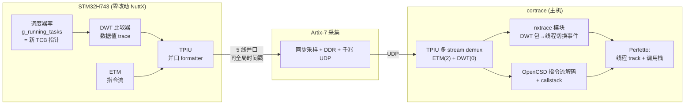

三条设计支柱：

1. **无侵入**：DWT 比较器监控内核写 `g_running_tasks`，硬件把"写入的新 TCB 指针"
   直接打进 trace 流，主机不回读目标内存。
2. **无 UAF**：TCB 指针由硬件在写发生的瞬间捕获（不丢短命线程）；线程身份
   （pid/优先级/名字）离线用 **ELF+DWARF 静态解析**，绝不在运行时按可能已释放的
   指针回读活动内存。
3. **同流同时钟**：ETM 与 DWT 走**同一条并口 TPIU**、盖**同一个全局时间戳**，
   两路数据天然对齐——这是并口平台相对 F429 SWO 混流方案的根本优势。

---

## 1. 问题定义

cortrace 现在能把 ETM 指令流还原成函数级调用栈时间线（周期级精度，见
`cortrace` 的 CCI cycle-count）。缺的一环是**线程维度**：一段 trace 里，
`nsh_main`、`hello_main`、idle 交替运行，调用栈需要归属到"当时在跑的线程"，
否则 Perfetto 里所有函数都堆在一条 track 上，无法按线程分泳道、无法统计
每线程 CPU 占用。

要素约束（用户明确要求）：

| 约束 | 含义 |
|------|------|
| **无侵入** | 不改 NuttX 源码、不占用内核 CPU 周期、不改 TCB 结构体 |
| **无 UAF** | 不在事件事后回读可能已被 `free` 的 TCB 内存 |
| 精确 | 事件级（每次切换都抓到），不是统计级轮询 |
| 对齐 | 线程事件与指令流共用同一时间基准 |

---

## 2. 方案选型：三种线程切换追踪方式

来自 TRACE32 逆向（`t32/docs/trace_system_summary_v2.md` §3.1/§3.3）与 H743 实测
（`orbtrace/docs/swo-trace-sidetrack/h743-dwt-thread-trace/`）的收敛结论：

| 方案 | 侵入性 | 精度 | UAF 风险 | 硬件前提 | 判定 |
|------|:------:|:----:|:--------:|---------|:----:|
| **A. DWT 数据 trace** | 零 | 事件级精确 | 可消除（见 §4） | DWT 比较器 + trace 出口 | ✅ **选定** |
| B. SWD/DAP 后台轮询 | 零 | **统计级，必漏切换** | 高（回读时 TCB 可能已释放）| 仅 SWD | ❌ 会漏、会 UAF |
| C. 极轻 ITM 插桩 | 微（改内核）| 事件级精确 | 低 | ITM + 1 stimulus | ⚠️ 违反"无侵入" |

选 **A（DWT 数据 trace）**：唯一同时满足"零侵入 + 事件级精确"的方案。

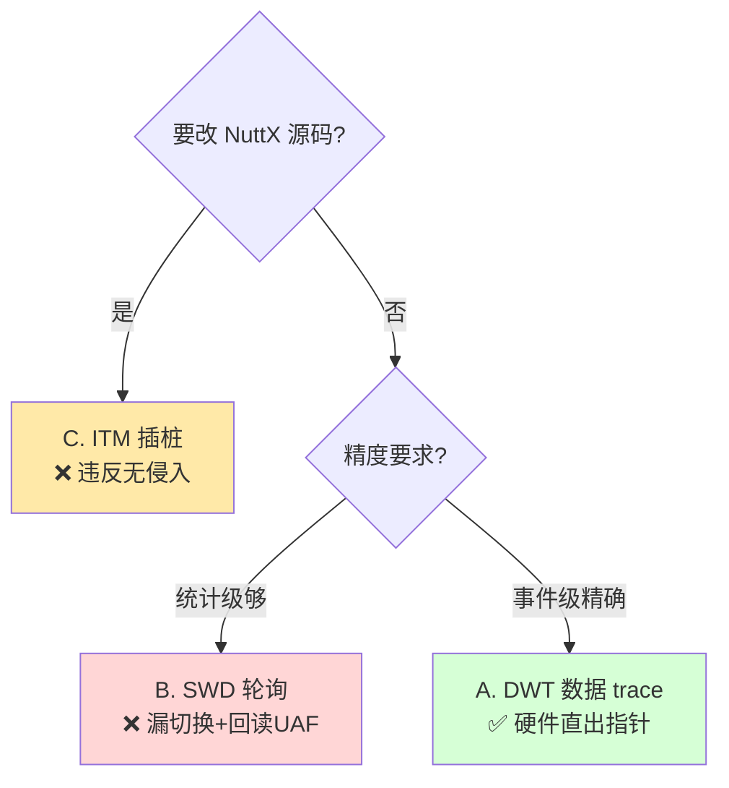

### 2.1 为什么不是 ContextID trace（CONTEXTIDR 路线）

理论最优路线是让 ETM 在指令流里内嵌 ContextID（写 `CONTEXTIDR` 时 ETM 自动发
Context 包，OpenCSD 原生支持按 ContextID 分线程）。**但已被硬件否决**：

> H743 ETMv4 上板实测 `TRCIDR2.CIDSIZE = 0` —— 该 ETM **不实现 ContextID trace**。
> （见历史结论，与 TSSIZE=8 支持 64bit 时间戳、CCI=1 支持 cycle count 并列。）

所以 ContextID 路线在本芯片不可用，退回 DWT 数据 trace。

### 2.2 为什么 SWD 轮询会 UAF（关键）

方案 B 的机制是主机周期性通过 SWD 读 `g_running_tasks` 拿当前 TCB 指针，再按指针
读 TCB 的 pid/name。两个致命问题：

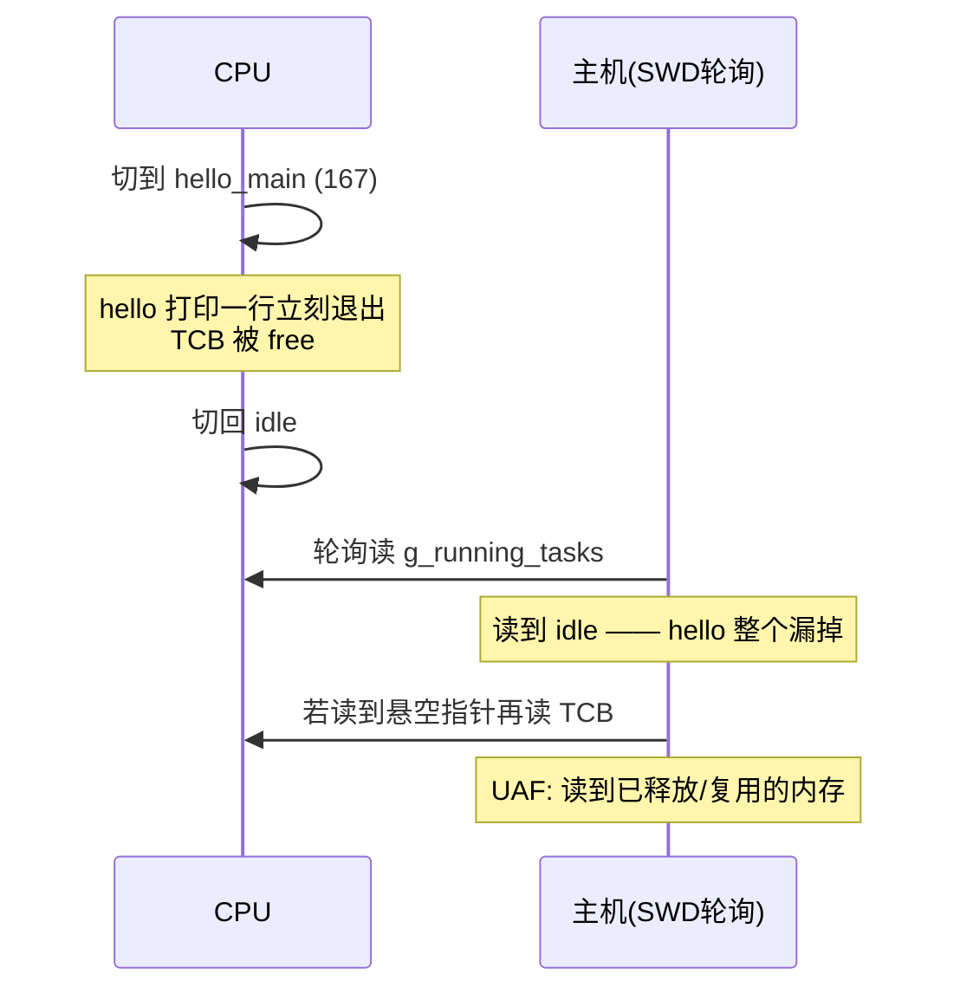

- **漏切换**：两次采样之间的切换看不见（统计级）。
- **UAF**：短命线程的 TCB 在主机回读时可能已 `free`，读到垃圾。

方案 A 从根上避免：硬件在**写发生的那一刻**就把写入值（新 TCB 指针）编码进 trace 流，
主机只解析流里已有字节，不回读活动内存。

---

## 3. 无侵入：DWT 监控 g_running_tasks

### 3.1 原理

DWT（Data Watchpoint and Trace）比较器可配成"命中对某地址的**写**访问时，产生一个
**数据值 trace 包**，payload 即被写入的值"。把比较器地址设为 `g_running_tasks`，
每次调度器切换线程写入新 TCB 指针时，DWT 硬件自动发一个带该指针的 trace 包。

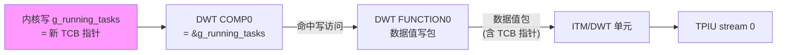

> H743 的 DWT/ITM 等 trace 组件挂在**系统总线地址 `0xE00xxxxx`（CPU 视角）**，且
> 配置前须先经 DBGMCU 使能 trace 时钟。具体寄存器序列见 §7。

### 3.2 与 F429 SWO 支线的差异（为什么并口是"正解平台"）

| 维度 | F429 SWO（支线，已验证）| **H743 并口（本方案）** |
|------|------------------------|------------------------|
| DWT 包出口 | SWO 单线（NRZ）| 并口 TPIU（与 ETM 同口）|
| ETM + DWT 混流 | ❌ F429 Simple TPIU 不能混流 | ✅ 标准 TPIU 多 stream，天然分流 |
| 时间对齐 | SWO 本地时间戳，与 ETM 难协议级对齐 | **同一全局时间戳**，协议级对齐 |
| 带宽 | 低（够 DWT，不够满速 ETM）| 高（ETM 满速 + DWT 富余）|

DWT 数据 trace 本身在 F429 SWO 上已实测跑通（短命 `hello_main` 稳定捕获，见参考
文档 §7.2 铁证）。本方案把同一机制搬到 H743 并口，收获"与 ETM 同流同时钟"。

---

## 4. 无 UAF：身份解析走 ELF 静态解析

DWT 只给出 TCB **指针**。线程身份（pid / 优先级 / 状态 / 名字）需要从该指针
解析。**绝不在运行时回读活动内存**（那正是 UAF 来源）。分两层：

### 4.1 结构布局来源：DWARF（本 ELF 无 g_tcbinfo）

这版 NuttX **没有编译进 `g_tcbinfo`** 自描述元数据（已确认符号表无此符号）。
但 ELF 带完整 DWARF（`.debug_info` 等），字段偏移可静态解出。**实测本 ELF**
（`nuttx_test/nuttx/nuttx`，via `gdb-multiarch`）：

| 字段 | 偏移 | 类型 | 用途 |
|------|:----:|------|------|
| `pid` | `0x30` | `pid_t`（int32）| 线程 id |
| `sched_priority` | `0x34` | uint8 | 优先级 |
| `task_state` | `0x40` | tstate_t | 运行/就绪/阻塞 |
| `entry` | `0x3C` | union{main,pthread} | **线程名来源**（见 §4.2）|
| `flags` | `0x44` | uint32 | 任务/线程标志 |
| `sizeof(struct tcb_s)` | `168` | — | 校验用 |

> **无 `name` 字段**：本配置 `CONFIG_TASK_NAME_SIZE=0`，TCB 里没有内嵌线程名。
> 所以名字不能从 TCB 读，改用 §4.2 的 entry 符号法。

nxtrace 用 DWARF 动态解析这些偏移（版本自适应），不硬编码。若将来某版编进了
`g_tcbinfo`，可优先读它（更省事），DWARF 作后备。

### 4.2 线程名：entry 指针 → ELF 符号

既然没有 `name` 字段，线程名从 `entry`（线程入口函数指针）反查 ELF 符号表：
`entry=0x08001234` → `addr2line`/符号表 → `hello_main`。这是**纯静态查表**
（ELF 符号表），与运行时内存无关，天然无 UAF。

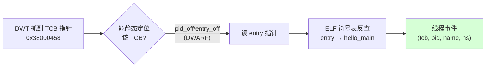

### 4.3 pid 也进流：多比较器彻底消除 UAF（可选增强）

上面的"按 TCB 指针静态解析"对**静态/长生命周期 TCB**（idle、nsh、静态创建的
任务）完全无 UAF——它们的 TCB 地址在 ELF/内存里稳定，指针→身份可离线定位。

但**动态创建的短命线程**，其 TCB 是运行时 `malloc` 的，地址不在 ELF 里，光有
指针无法离线知道 pid/name。此时有两条无 UAF 的路：

- **路 1（推荐，纯离线）**：再配一个 DWT 比较器 watch `g_running_tasks` 切换点
  附近对 TCB 内 `pid` 字段的写，或在切换序列里让 pid 也进流。这样"指针 + pid"
  成对出现在 trace 流，pid 是硬件抓的瞬时值，不依赖事后回读。
- **路 2（在线但无 UAF 窗口）**：仅对**流里出现过、且此刻仍在 `g_pidhash` 表中**
  的 TCB，通过 SWD 读一次身份并缓存。`g_pidhash`（@0x240003dc，`struct tcb_s **`）
  + `g_npidhash`（@0x240003e0）构成 pid→TCB 映射；只读仍在表中的条目可避免
  悬空指针。代价是需要在线连接，不是纯离线。

> 离线纯 trace 场景优先"路 1"。多比较器 H743 DWT 支持（比较器数量见
> `DWT_CTRL.NUMCOMP`，上板确认）。

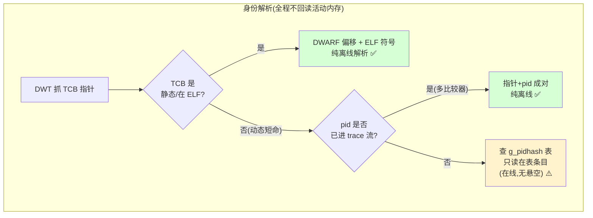

---

## 5. cortrace 侧：nxtrace 解码模块

### 5.1 多 stream demux（前置改造）

现状：`tpiu_deframe(data, want_stream, ...)`（C++ `deframe.cpp` / Python
`tpiu_official.py`）一次只提取**一个** stream（出货用 `want_stream=2` 取 ETM）。
DWT 数据包走另一个 stream（ITM/DWT 单元的 trace ID，通常 stream 0/1）。

改造：让 deframe 一趟demux出**多个** stream，各自带 RAW 字节偏移（时间基），
使 ETM 流与 DWT 流索引到同一 FPGA 时间基数组：

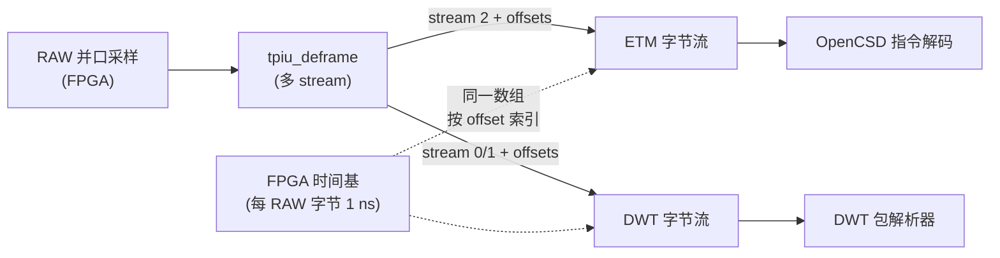

接口草案（保持向后兼容：`want_stream<0` 仍可取单流）：

```cpp
// deframe.hpp —— 新增多流版本，返回 stream_id -> {bytes, src_offsets}
struct MultiDeframeResult {
    std::map<int, std::vector<uint8_t>>   streams;      // stream_id -> bytes
    std::map<int, std::vector<uint64_t>>  src_offsets;  // 每字节的 RAW 偏移
    std::size_t frames, syncs, async_count;
};
MultiDeframeResult tpiu_deframe_multi(const std::vector<uint8_t>& data,
                                      const DeframePhase& phase);
```

### 5.2 DWT 数据值包解析器

DWT 数据值写包（ARMv7-M ARM, DDI0403E, Table D4-7）：包头 `(b & 0xC0)==0x80`
且 bit2=1（硬件源）、bit3=1（写），后跟 SS 指示的 payload 字节数（TCB 指针=4 字节，
小端）。比较器号在 CMPN[5:4]。解析出 `(comp_id, written_value)`：

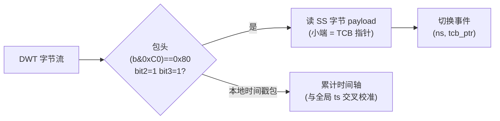

> 时间：并口方案下每个 RAW 字节已有 FPGA 全局时间基（ns），DWT 包的 ns 直接取
> 其源字节偏移对应的时间——**与 ETM 同一把尺子**。DWT 自身的本地时间戳包用于
> 交叉校准/查漏，不作主时基。

### 5.3 事件 → Perfetto 线程 track

nxtrace 把解析出的切换事件序列（`ns, tcb_ptr → pid, name`）转成 Perfetto 的
线程调度信息：每个线程一条 track，指令流的函数调用栈按"当前线程"归属到对应
track。复用 cortrace 已有的 Perfetto 导出（`perfetto_writer.cpp`）。

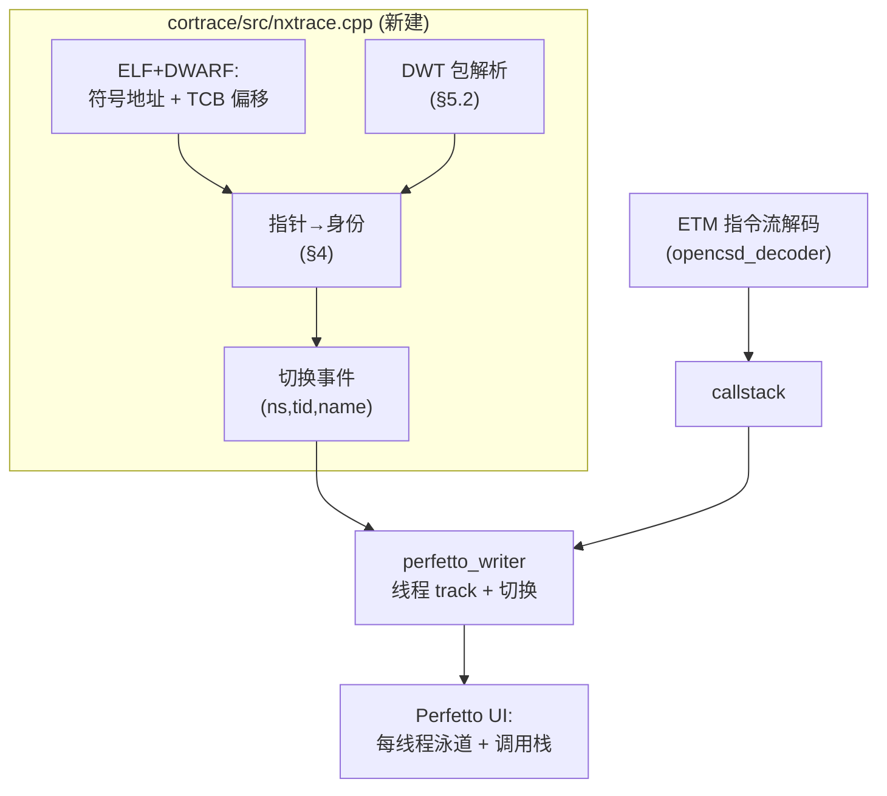

CLI 草案（沿用现有风格，`--elf` 已存在）：

```
cortrace_decode --raw <capture.bin> --elf <nuttx> \
                --nx-switch-stream 0 \        # DWT 所在 stream
                --nx-running-tasks 0x240003bc \  # 可选,默认从 ELF 符号取
                -o out.perfetto
```

---

## 6. 地基验证计划（不依赖装 NuttX）

在写 nxtrace 之前，先用**当前 H743 固件 + 一个全局变量**验证"并口能同时载 ETM
和 DWT 数据包、且时间戳对齐"这一地基。这一步与 NuttX 无关，纯验平台能力。

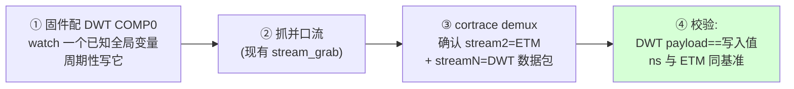

| 步骤 | 验收 |
|------|------|
| ① 固件：加 DWT 比较器 watch 一个测试全局变量，主循环周期写入递增值 | 寄存器读回正确 |
| ② 抓流 | 0 dropped（沿用现有链路指标）|
| ③ cortrace demux 出 ETM(stream2) + DWT(streamN) | 两路都非空 |
| ④ DWT payload 小端解出 == 固件写入的递增值；DWT 事件 ns 落在 ETM 时间轴内 | 值吻合、ns 对齐 |

通过后再进 NuttX：把测试全局变量换成 `g_running_tasks`，接入 §4/§5。

---

## 7. 关键寄存器（H743，CPU 视角 0xE00xxxxx）

> 与 SWO 支线共用同一套 DWT/ITM 编码，差别在出口走并口 TPIU（多 stream）而非 SWO。
> 上板配置必须**运行态**操作（reset-halt 会读到上电默认值）。

| 组件 | 寄存器 | 地址 | 值/说明 |
|------|--------|------|---------|
| DBGMCU | CR | `0x5C001004` | 使能 trace 时钟（TRACECLKEN）|
| DWT | COMP0 | `0xE0001020` | = `&g_running_tasks`（0x240003bc）|
| DWT | MASK0 | `0xE0001024` | `0`（精确地址匹配）|
| DWT | FUNCTION0 | `0xE0001028` | `0x0D`（数据值写包；**非** 0x07 watchpoint 会停机）|
| ITM | TCR | `0xE0000E80` | 使能 ITM + 时间戳 + 同步 |
| ITM | LAR | `0xE0000FB0` | 解锁 `0xC5ACCE55` |
| TPIU | — | `0xE0040xxx` | 并口模式（非 SWO），formatter on 多 stream |

（DWT 数据值写包头 `0x8F`、本地时间戳包等编码详见参考文档 §3。）

---

## 8. 与现有工作的衔接

| 复用 | 位置 |
|------|------|
| TPIU deframe（want_stream 语义）| `cortrace/src/deframe.cpp`、`cortrace-fpga/host/decode/tpiu_official.py` |
| FPGA 全局时间基（每 RAW 字节 1 ns）| `cortrace-fpga/host/decode/make_timebase.py` |
| ETM 指令解码 + callstack | `cortrace/src/opencsd_decoder.cpp`、`callstack.cpp` |
| Perfetto 导出 | `cortrace/src/perfetto_writer.cpp` |
| ELF 直读（PT_LOAD 段）| cortrace `add_elf()`（已有）|
| **新建** | `cortrace/src/nxtrace.cpp`（DWT 包→线程事件）+ deframe 多流改造 |

---

## 9. 实施路线

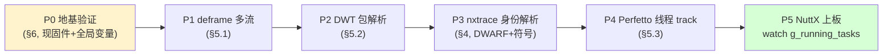

每步独立可验、可回退。P0 通过前不写解码代码；P5 前所有解码逻辑用地基验证的
合成数据打通。

---

## 10. 风险与对策

| 风险 | 对策 |
|------|------|
| 动态短命线程 TCB 不在 ELF，指针无法离线解身份 | §4.3 路 1：多比较器让 pid 也进流（纯离线）|
| DWT 比较器数量不足（ETM 地址过滤 + 线程 watch 抢比较器）| 上板读 `DWT_CTRL.NUMCOMP` 确认；本方案指令-only ETM 不占地址比较器 |
| DWT 包与 ETM 抢并口带宽 | 线程切换是低频事件（每次 4~5 字节），相对满速 ETM 占比极小 |
| 无 `g_tcbinfo`，偏移随 NuttX 版本变 | DWARF 动态解析（版本自适应），不硬编码 |
| 无 `name` 字段 | entry 指针反查 ELF 符号（§4.2）|
| ContextID 路线不可用 | 已由 `TRCIDR2.CIDSIZE=0` 否决，本方案不依赖 |

---

## 附：本 ELF 实测符号与偏移（nuttx_test/nuttx/nuttx）

内核符号（`arm-none-eabi-nm`）：

| 符号 | 地址 | 类型 |
|------|:----:|------|
| `g_running_tasks` | `0x240003bc` | per-CPU 当前任务 |
| `g_readytorun` | `0x240003b4` | 就绪链表头 |
| `g_pidhash` | `0x240003dc` | `struct tcb_s **`（pid→TCB）|
| `g_npidhash` | `0x240003e0` | 哈希表大小 |
| `g_tcbinfo` | — | **不存在**（本版未编入）|

TCB 字段偏移（DWARF，`gdb-multiarch`）：pid@0x30 · sched_priority@0x34 ·
entry@0x3C · task_state@0x40 · flags@0x44 · sizeof=168 · **无 name 字段**。

ELF：ARM EABI5、hard-float、含完整 `.debug_info`/`.debug_str`/`.debug_line`。
